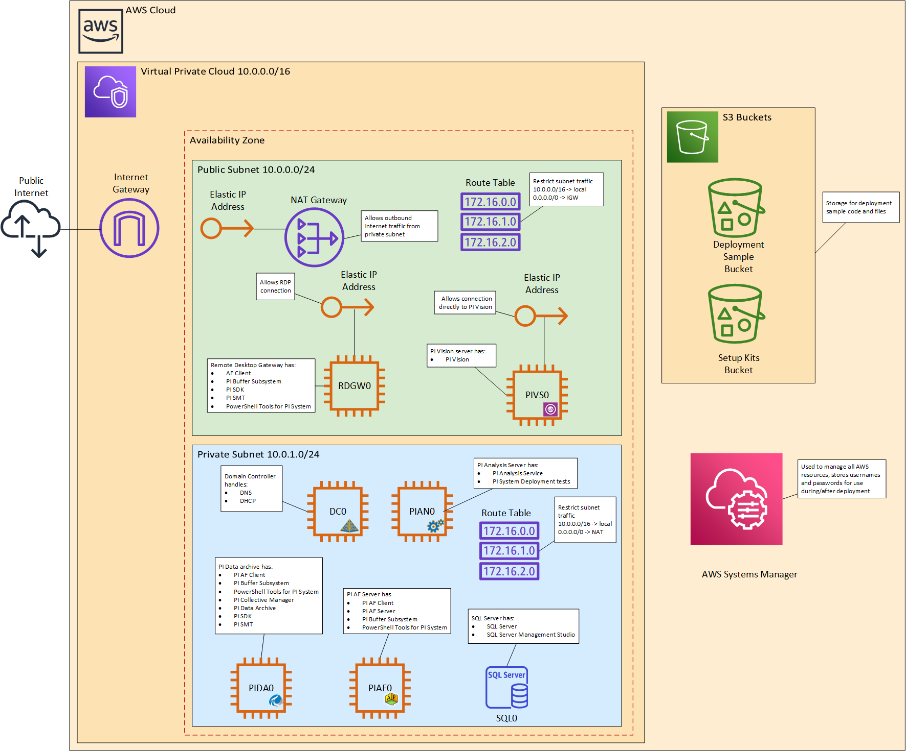
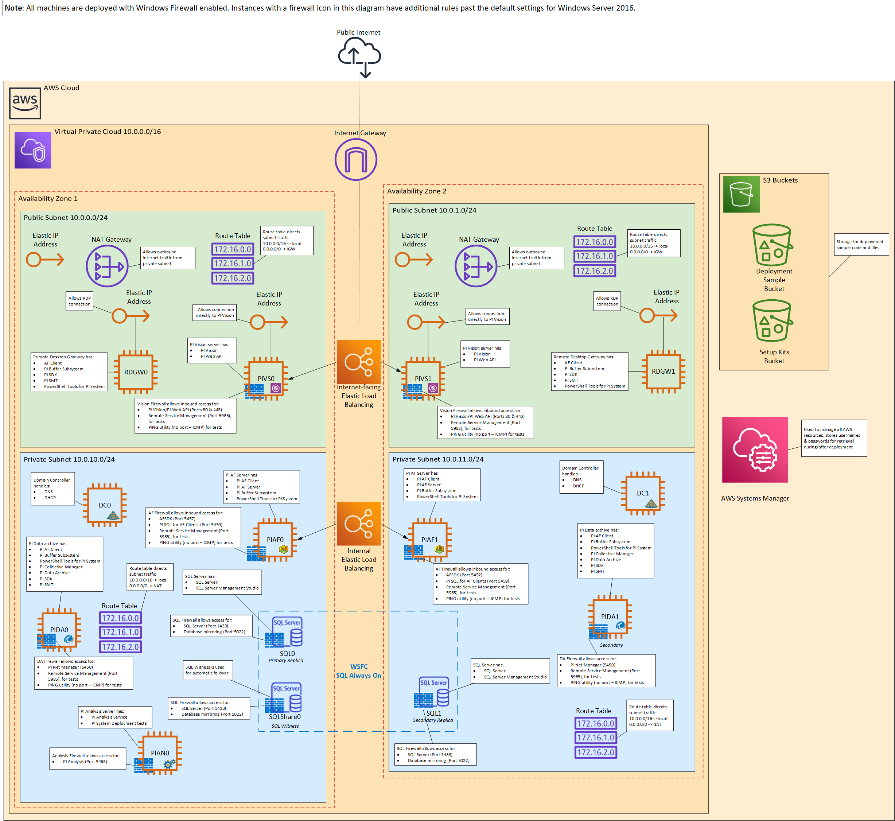

 # OSIsoft PI System on Amazon Web Services

PI System Deployment Sample for Amazon Web Services (AWS) was created by OSIsoft, LLC in collaboration with Amazon Web Services. 
Deployment samples are automated reference deployments that use AWS CloudFormation templates to deploy key technologies on AWS, following AWS best practices.

## Overview
This deployment guide provides step-by-step instructions for deploying a PI System on the AWS environment for a new Virtual Private Cloud (VPC) infrastructure using PI System Deployment Samples for AWS. 

PI System Deployment Sample for AWS is intended for use by existing OSIsoft customers to support quick and iterative testing and prototyping purposes. As development environments move to the cloud, PI Admins need easy and quick ways to deploy resources for their testing cycles. The PI System Deployment Sample for AWS provides an easy way to deploy a full PI System repeatedly and reliably to the AWS cloud for this type of development cycle. 
>**Note:** The deployment samples are meant for testing and prototyping purposes, and not meant to be used within a production environment.

The deployment samples install core PI System components, such as PI Data Archive and PI Asset Framework. 

|  | 
|:--:| 
| *Non-HA Architecture Diagram* |

Optionally, the deployment sample supports the ability to deploy PI System in a High Availability (HA) configuration. 

|  | 
|:--:| 
| *HA Architecture Diagram* |

>**Note:** The AWS CloudFormation template discussed in this guide (*DSMasterStack.template*) is meant for deployment with a new AWS infrastructure, and not meant to be used on an existing AWS environment.

### OSIsoft PI System on AWS
With PI System Deployment Sample for AWS, you deploy a PI System on a new VPC (an end-to-end deployment). The deployment template for a new VPC (`DSMasterStack.template`) builds a new AWS environment consisting of the VPC, private and public subnets, NAT gateways, Internet gateway, security groups, bastion hosts, and other infrastructure components essential for the new PI System. In addition, the deployment includes Active Directory, SQL Server, PI Data Archive, PI AF, PI Analysis Service, PI Vision, PI Web API, and Remote Desktop Service into this new VPC.

Per standard security practices, the environment is accessible via Remote Desktop Service EC2 instances. 

Optionally, the deployment samples support the ability to deploy a PI System in a High Availability configuration, taking advantage of dynamic capabilities of the AWS cloud. This allows for scaling of compute EC2 types and storage capacity as your PI System grows in scope and scale, especially in regards to data aggregation and analysis. 

### Costs and Licenses
You are responsible for the cost of the AWS services and resources used in association with the deployment samples. Outside of that, there are no additional operating costs associated with the deployment samples.

You are encouraged to estimate the additional AWS costs associated with PI System deployment as part of your planning process. To assist with cost estimates, refer to the [AWS Pricing](https://aws.amazon.com/pricing/)   page corresponding to each AWS service you will deploy. Note that prices are subject to change. The AWS CloudFormation template discussed in this guide includes configuration parameters that you can customize. The value you specify, such as instance type, will affect the AWS costs associated with the deployment. 

> **Tip:** After you deploy using PI System Deployment Samples for AWS, OSIsoft recommends that you enable the [AWS Cost and Usage Report](https://docs.aws.amazon.com/awsaccountbilling/latest/aboutv2/billing-reports-gettingstarted-turnonreports.html) to track costs associated with this template. This report delivers billing metrics to an S3 bucket in your account. It provides cost estimates based on usage throughout each month, and finalizes the data at the end of the month. For more information about the report, see the [AWS documentation](https://docs.aws.amazon.com/awsaccountbilling/latest/aboutv2/billing-reports-costusage.html). 

To use PI System Deployment Samples for AWS, you must be an existing OSIsoft customer and have access to the OSIsoft [Customer Portal](https://customers.osisoft.com). Access to the OSIsoft Customer Portal is required to download the necessary software, as well as to generate and download a full license for your PI System after the deployment. If you are new to the OSIsoft PI System, please reach out to us to request further information at the OSIsoft [Contact Page](https://www.osisoft.com/about-osisoft/contact-us/).

## Deployment Architecture for PI System on AWS
PI System Deployment Sample for AWS creates the following infrastructure:

### Non-HA Deployment Architecture
* A virtual private cloud configured with public and private subnets according to AWS best practices, to provide you with your own virtual network on AWS.
* An Internet gateway to allow access to the Internet contained in the public subnets. This gateway is used by the bastion hosts to send and receive traffic. A bastion host is a server instance that acts as the primary access point from the Internet and as a proxy to the other server instances.
* In the public subnets, managed Network Address Translation (NAT) gateways to allow outbound Internet access for resources in the private subnets.
* In the public subnets, a Remote Desk Service (RDGW) host to allow inbound Remote Desktop Protocol (RDP) access to server instances in public and private subnets.
* In the public subnet(s), a PI Vision server (as bastion node) used for data visualization accessible via HTTPS.
* In the private subnet(s), a PI Data Archive server configured to OSIsoft field service technical standards.
* In the private subnet(s), a PI Asset Framework (AF) server.
* In the private subnet(s), a standalone PI Analysis Service present to handle PI Analysis Service configured on PI AF.
* Identity and Access Management (IAM) roles to provide permissions to access AWS resources. For example, to permit the virtual server instances to read from the S3 buckets containing the install media files and PI license.

### HA Deployment Architecture
If selected, an HA architecture spans two Availability Zones, each zone consisting of one or more discrete data centers, each with redundant power, networking, and connectivity, housed in separate facilities. 
>**Note:** If High Availability is not specified during deployment, a single  Availability Zone is used.
* A virtual private cloud configured with public and private subnets according to AWS best practices, to provide you with your own virtual network on AWS.
* An Internet gateway to allow access to the Internet contained in the public subnets. This gateway is used by the bastion hosts to send and receive traffic. A bastion host is a server instance that acts as the primary access point from the Internet and as a proxy to the other server instances.
* In the public subnets, managed Network Address Translation (NAT) gateways to allow outbound Internet access for resources in the private subnets.
* In the public subnets, a pair of Remote Desk Service (RDGW) hosts to allow inbound Remote Desktop Protocol (RDP) access to server instances in public and private subnets.
* In the public subnet(s), a pair of PI Vision servers (as bastion nodes) used for data visualization accessible via HTTPS through an Internet-facing Elastic Load Balancer (EBL).
* In the private subnet(s), a PI Data Archive server configured as a PI Data Archive Collective for high availability, configured to OSIsoft field service technical standards.
* In the private subnet(s), PI Asset Framework (AF) server exposed behind an internal Elastic Load Balancer (EBL).
* In the private subnet(s), a standalone PI Analysis Service present to handle PI Analysis Service configured on PI AF.
* Identity and Access Management (IAM) roles to provide permissions to access AWS resources. For example, to permit the virtual server instances to read from the S3 buckets containing the install media files and PI license.

In addition, the deployment sample sets up OSIsoft Field Service Technical Standards Active Directory groups to easily manage user access and permissions to the deployed  PI System.

## Prerequisites for Deployment
### Software Requirements
PI System Deployment Sample for AWS require that you have access to:
* PI Server install kit
* PI Vision install kit
* Temporary PI license
* PI System Deployment Tests zip file: You can find this available at the [OSIsoft GitHub Repository](https://github.com/osisoft/OSI-Samples-PI-System/tree/master/PI-System-Deployment-Tests)

>**Note:** The deployment sample will first use the temporary PI license to deploy a  PI System on AWS. After the deployment is finished, you must generate a full PI license file through the OSIsoft Customer Portal using the Machine Signature File created from your deployed PI Data Archive(s) in your AWS VPC. This process is discussed later in this guide.

The AWS CloudFormation template will setup the PI components associated with a PI System so they are available in an operationally-ready state. Downloading these products and generating a PI license file are discussed later in this guide, and are also detailed in the *PI Server Installation and Upgrade Guide* on the **Products** page on the OSIsoft [Customer Portal](https://my.osisoft.com).

### Specialized Knowledge
Before you deploy a deployment sample, OSIsoft recommends that you familiarize yourself with the following AWS services. (If you are new to AWS, see [Getting Started with AWS](https://aws.amazon.com/getting-started/).)
* [Amazon EC2](https://aws.amazon.com/documentation/ec2/)
* [Amazon EBS](https://docs.aws.amazon.com/AWSEC2/latest/UserGuide/AmazonEBS.html)
* [Amazon VPC](https://aws.amazon.com/documentation/vpc/)
* [Amazon Elastic Load Balancing](https://aws.amazon.com/elasticloadbalancing/)
* [Amazon S3](https://aws.amazon.com/s3/)
* [AWS CloudFormation](https://aws.amazon.com/documentation/cloudformation/)
* [AWS Systems Manager Parameter Store](https://docs.aws.amazon.com/systems-manager/latest/userguide/systems-manager-paramstore.html)

### High Availability Consideration

The High Availability configuration for PI System on AWS takes advantage of dynamic capabilities of the AWS cloud. This allows for scaling of compute EC2 types and storage capacity as your PI System grows in scope and scale, especially in regards to data aggregation and analysis.

Before you deploy PI System Deployment Sample for AWS, consider whether to deploy a PI System in a High Availability configuration or not. High Availability provides improved resiliency against outages and failure. However, High Availability requires more AWS resources than a non-High Availability configuration. Evaluate this with your specific needs as part of your planning process. 

* **PI System in High Availability.** This option creates two instances of almost each application. There will be one instance deployed in each of the subnets specified by the user. It is the responsibility of the user to ensure that these two subnets are correctly configured in different availability zones to ensure true high availability of resources.
* **PI System without High Availability.** This options creates only a single instance of each application. This option uses fewer resources within AWS.

Note that the same AWS CloudFormation template is used for both of these options. Users can customize the instance types and service accounts used by PI System from the template, as well as restricting external access to the Remote Desktop Gateway using a CIDR block. These settings are discussed in more detail later in this guide.

## Deployment Procedure
### Step 1: Prepare Your AWS Account
1.	If you don’t already have an AWS account, create one at this [link](https://aws.amazon.com) and following the on-screen instructions. 
2. Sign in to the [Amazon Management Console](https://console.aws.amazon.com/).
3.	Select a region using the region selector dropdown list in the top navigation bar. The AWS Region specifies where you want to deploy the PI System on AWS.
4. Click **Compute** > **EC2** > **Key Pairs** to access the list of key pairs.
5. Click **Create Key Pair** to create a [key pair](https://docs.aws.amazon.com/AWSEC2/latest/UserGuide/ec2-key-pairs.html) in your selected AWS Region. Public-key cryptography uses key pairs to enable secure access to your EC2 instances. When you launch an instance, you specify the key pair. 
6.	If necessary, [request a service limit increase](https://console.aws.amazon.com/support/home#/case/create?issueType=service-limit-increase&limitType=service-code-) for the Amazon EC2 M and T instance types. You might need to do this if you already have an existing deployment that uses this instance type, and you think you might exceed the [default limit](http://docs.aws.amazon.com/AWSEC2/latest/UserGuide/ec2-resource-limits.html) with this deployment. 

> **Note:** Deploying PI System stack into a new VPC will require **7** public IP addresses. The default service limitation for an AWS account is 5 public IP addresses. To successfully deploy the deployment sample, you may need to request a limit increase for this resource. AWS documentation on limit increases can be found under [Amazon EC2 Service Limits](https://docs.aws.amazon.com/AWSEC2/latest/UserGuide/ec2-resource-limits.html).

### Step 2: Ensure Appropriate Licensing for SQL Server
The deployment samples build a highly available Microsoft SQL Server environment, including Microsoft Windows Server and SQL Server running on Amazon Elastic Compute Cloud (Amazon EC2). A multi-node SQL Always On availability group uses Windows Server Failover Clustering (WSFC) to increase application availability. 

Appropriate licensing for SQL Server is essential for a successful deployment. 
> **Note:** You must obtain a valid SQL Server license within 180 days of deployment. 

For more information on this, see the Costs and licenses section of [SQL Server on AWS](https://aws.amazon.com/quickstart/architecture/sql/).

### Step 3: Set Up the Deployment Sample Code
To deploy the OSIsoft PI System Deployment Sample for AWS, you will need to download and stage the associated modules, scripts, and AWS CloudFormation templates which are available in the [OSIsoft GitHub repository](https://github.com/osisoft/OSI-Samples-PI-System/tree/master/PI-System-Deployment-Samples/AWS).

Your PI System on AWS deployment is based on the AWS stack. A stack is the collection of the AWS resources associated with a PI System deployment. 

The following list highlights the files and respective folders found in the OSIsoft GitHub deployment samples repository:

* .\images - Contains images for the readme files.
* .\modules - Contains various PowerShell modules used for the deployment, including but not limited to tools that make it easier to configure and install the PI System.
* .\scripts - Contains PowerShell scripts that set up and configures PI System components.
* .\templates - Contains a number of different CloudFormation templates that define the AWS stack, which in turn determine the end deployment. 
* MasterStackReadme.md - This deployment guide.
* README.md - The introductory readme file for the repository.
* TestParametersReadme.md - The readme file on how to run a test on the parameters of your S3 buckets using the `TestParameters.ps1` script. The script is meant as a tool to aid the PI System Engineers who are deploying the Master Stack template on AWS. Running this script validates the contents of the S3 buckets the user must create before using the AWS Deployment Sample successfully.

These files and folders must be stored in an S3 bucket in your AWS account for the deployment to succeed. To do this:

1.	Click **Storage** > **S3** on the [Amazon S3 console](https://s3.console.aws.amazon.com/s3/) to access the list of S3 buckets for your AWS account.
2.	Click **Create bucket** to create an S3 bucket and name it with a *BucketName*, such as `s3bucket-osideploymentsamples-username`. For instructions, see the [Amazon S3 documentation](https://docs.aws.amazon.com/AmazonS3/latest/gsg/CreatingABucket.html). Record the *BucketName*. You will need it when filling out the AWS template. Take care as *BucketName* is case-sensitive!
2. Click **Create folder** to create a folder in this bucket and name it with a *FolderName* such as `DeploymentSample` into which you will upload the files. Record the *FolderName*. You will need it when filling out the AWS template.
3. Separately, browse onto the OSIsoft GitHub repository for AWS [here](https://github.com/osisoft/OSI-Samples-PI-System/tree/master/PI-System-Deployment-Samples/AWS).
4. Click **Download as Zip** to download the contents of this GitHub repository, and select the target location on your local machine. 
5. Extract the contents of this zip file onto your local machine. Take note of this location as you will need to upload a local copy of the `DSMasterStack.template` in the `template` folder in a later step. 
5. Upload the extracted contents into the newly-created folder in your S3 bucket. 
   
   > **TIP:** Some users who have adblock extensions installed on their browser have reported errors when uploading the Active Directory scripts. Temporarily disabling the adblock extension fixes this problem. 
   
Once the upload is complete, ensure that the subfolders have been created directly beneath the folder you created in step 2. Your folder structure should resemble the following directory:

```
<BucketName>
|--> <FolderName>
    |--> images   
    |--> modules
    |--> scripts
    |--> templates
    |--> MasterStackReadme.md
    |--> README.md
    |--> TestParametersReadme.md
```

### Step 4: Download and Stage PI System Files
Next, you will need to download the following PI System files:
* PI Server install kit
* PI Vision install kit
* Temporary license file 
* PI System Deployment Tests zip file

The following sections describe the process for finding and staging these files.
>**Note:** The deployment sample will use the temporary PI license to deploy PI System on AWS to install PI System. When a successful PI deployment is installed, you will be able to generate a full PI license file through the OSIsoft Customer Portal using the Machine Signature File created from your deployed PI Data Archive(s).

The deployment sample must have access to the aforementioned files in an S3 bucket in your AWS account.

>**Note:** Ensure you download and use the exact version of the PI Server (PI Server 2018 SP3) and PI Vision (PI Vision 2019) install kits described in this guide!

#### Create PI Install Folders in the S3 Bucket
1.	From the [Amazon Management Console](https://console.aws.amazon.com/), click **Storage** > **S3**.
2.	Click **Create bucket** to create another S3 bucket. This bucket will hold your setup kits necessary for PI System deployment. 
3. Name your new bucket with a *SetupKitsBucketName*, such as `s3bucket-osisetupkits-username`. For instructions, see the [Amazon S3 documentation](https://docs.aws.amazon.com/AmazonS3/latest/gsg/CreatingABucket.html). Record the *SetupKitsBucketName*. You will need the name of this bucket when filling out the template.
4. Click **Create folder** to create a folder with a *SetupKitsFolderName* such as `osisetupkits` which will hold the PI install kits and the temporary license file. Record this *SetupKitsFolderName*. You will need it when filling out the AWS stack parameters.
5. In this folder, create two new folders with the following exact *FolderNames*: `PIServer` and `PIVision`. To create a new folder, click **Create folder**.
>**Note:** Use these exact folder names as indicated. These folder names are case sensitive!

#### Download and Stage the PI Server Install Kit and Temporary License File
1. From the **Products** page on the OSIsoft [Customer Portal](https://my.osisoft.com), click on the product row for **PI Server**.
2. Click the **ALL VERSIONS** tab to display the **PI Server 2018 SP3** version of PI Server.
3. On the row corresponding to the **PI Server 2018 SP3** version of the install kit, click **Download** to display the **License and Service Agreements** page.
4. Agree to the **OSIsoft, LLC. (“OSIsoft”) Software License and Services Agreement** and click
**Download**
5. When prompted to run or save the executable setup file, click **Save** and click **OK**.
6. Locate your temporary PI license file and rename the file to **pilicense.dat**. If you do not have a temporary PI license, please contact OSIsoft Tech Support to obtain a temporary license for the deployment. OSIsoft Tech Support can be reached at the OSIsoft [Customer Portal](https://my.osisoft.com).
7. Upload your PI Server install kit and your renamed PI license file into the `PIServer` folder.

#### Download and Stage the PI Vision Install Kit
1. From the **Products** page on the OSIsoft [Customer Portal](https://my.osisoft.com), click on the product row for **PI Vision**.
2. Select the  **ALL VERSIONS** tab to display the **PI Vision 2019** version of PI Vision.
3. On the row corresponding to the **PI Vision 2019** version of the install kit, click **Download** to display the **License and Service Agreements** page.
4. Agree to the **OSIsoft, LLC. (“OSIsoft”) Software License and Services Agreement** and click **Download**.
5. When prompted to run or save the executable setup file, click **Save** and click **OK**.
6. Upload your PI Vision installer into the `PIVision` folder.

#### Download and Stage PI System Deployment Tests File
1. Go to the OSIsoft GitHub repository for PI System Deployment Tests at this [page](https://github.com/osisoft/OSI-Samples-PI-System/tree/master/PI-System-Deployment-Tests).
2. Click **Download as Zip** to download the contents of this GitHub repository onto your local machine as a zip file. The deployment samples will configure and run the deployment tests for your environment.
3. Upload this zip file into the *SetupKitsFolderName* folder in your S3 bucket on the [Amazon Management Console](https://s3.console.aws.amazon.com/s3/). 

#### Verify your S3 Bucket
Verify that your bucket has a hierarchy with the files and folders matching the following:

```
<SetupKitsBucketName>
|--> <SetupKitsFolderName>
   |--> PIServer
      |--> pilicense.dat
      |--> PI Server_2018 SP3_.exe
   |--> PIVision
      |--> PI-Vision_2019.exe
   |--> PI-System-Deployment-Tests-master.zip
```
### Step 5: Launch the Deployment Sample
Launch PI System Deployment Sample for AWS to deploy PI System into your AWS environment.
> **Note:** You are responsible for the cost of the AWS services used while running this deployment sample. Outside of those, there is no additional cost for using this deployment sample. For full details on costs, see the pricing pages for each AWS service in your deployment. Note that prices are subject to change.

1. Run a test on the parameters and settings for your S3 bucket using the `TestParameters.ps1` PowerShell script located in the `scripts` folder. The `TestParametersReadme.md` file outlines how to run this script to test your parameters and settings. Fix any problems identified by the script.
2. Click **Management & Governance** >  **CloudFormation** > **Stacks** > **Create stack** on the [Amazon Management Console](https://.console.aws.amazon.com/).
3. Select the region by using the region selector dropdown list in the upper-right corner of the navigation bar. This region is where the network infrastructure for OSIsoft PI System will be built. 
4. If necessary, change the region.
>**Note:** While not required, matching the region of the AWS stack with the S3 bucket is a good idea to minimize any errors that may arise from timeouts, etc.
5. On the **Create stack** page, select the options for **Template is ready** and **Upload a template file**. 
6. Click **Choose file** and select the  `DSMasterStack.template` file located in the `templates` folder on your local computer. In a previous step, you extracted this from a zip file.
7. On the **Specify stack details** page, provide a name for the stack. Review the parameters for the template. Provide values for the parameters that require input. For all other parameters, review the default settings and customize them as necessary. The following sections provide details about these parameters. 
8. On the **Configure stack options** page, add tags, set permissions, and configure any other options for this deployment. For more information about these parameters, see [Setting AWS CloudFormation Stack Options](https://docs.aws.amazon.com/AWSCloudFormation/latest/UserGuide/cfn-console-add-tags.html)
9. Review your settings. Select the checkboxes acknowledging that AWS CloudFormation might create IAM resources with custom names and that AWS CloudFormation might require the following capability: **CAPABILITY_AUTO_EXPAND**. 
10. Click **Create stack** to start the deployment.
> **Note:** This deployment takes 1-4 hours to complete, so plan accordingly.

#### Template Parameters 
The deployment templates define a number of parameters for your AWS stack. While many have defaults, a number of parameters for your stack requires user input. All settings should be reviewed in case the default does not suffice.
The tables below are grouped under the same headers as used in the template itself for your stack.

##### Global Configuration
 Parameter | Default | Description
---|---|---
Availability Zones | *Requires Input* | List of Availability Zones (AZ) to use for the subnets in the VPC. Note: The logical order is preserved and only 2 AZs are used for this deployment. Two AZs are needed for an HA deployment.
Deploy HA | true | Deploy 2 instances for HA
Name Prefix | *Requires Input* | Prefix used when naming resources, inputs, and outputs. Maximum 24 characters
Key Pair Name | *Requires Input* | Public/private key pairs allow you to securely connect to your instance after it launches

##### Network Configuration
 Parameter | Default | Description
---|---|---
RDGWCIDR | *Requires Input* | Allowed CIDR Block for external access to the Remote Desktop Gateways. Recommended value: *myipaddress*/32
PIInCIDR | *Requires Input* | Allowed CIDR Block for allowed PI Data Ingress sources. Recommended value: match **RDGWCIDR**

##### Active Directory Configuration
 Parameter | Default | Description
---|---|---
ADServerInstanceType | t3.medium | Amazon EC2 instance type for the Active Directory instances
DomainDNSName | osideploysample.int | Fully qualified domain name (FQDN) of the forest root domain e.g. example.com
DomainNetBIOSName | osideploysample | NetBIOS name of the domain (up to 15 characters) for users of earlier versions of Windows e.g. EXAMPLE
DomainAdminUserName | piadmin | User name for the account that will be added as Domain Administrator. This is separate from the default \"Administrator\" account
DomainAdminPassword | *Requires Input* | Password for the domain admin user. Must be at least 8 characters containing letters, numbers and symbols
RestoreModePassword | *Requires Input* | Password for a separate Administrator account when the domain controller is in Restore Mode. Must be at least 8 characters containing letters, numbers and symbols

##### SQL Configuration
 Parameter | Default | Description
---|---|---
SQLServiceAccount | svc-sql0 | User name for the SQL Server Service Account. This Account is a Domain User.
SQLFileServerInstanceType | t3.small | Amazon EC2 instance type for a fileserver used to share install media, witness and replication folders
SQLNodeInstanceType | m4.xlarge | Amazon EC2 instance type for the first SQL Node
Volume1Size | 500 | Volume size for the SQL Data drive, in GB
Volume2Size | 500 | Volume size for the SQL Logs drive, in GB
Volume3Size | 500 | Volume size for the SQL Backups and TempDB drive, in GB  

##### Remote Desktop Gateway Configuration
 Parameter | Default | Description
---|---|---
RDGWInstanceType | t3.large | Amazon EC2 instance type for the Remote Desktop Gateway instances

##### PI Parameters
 Parameter | Default | Description
---|---|---
PIDAInstanceType | m5.xlarge | PI Data Archive EC2 instance type
PIDADiskSizeinGB | 128 | PI Data Archive Disk Size in GB
PIAFInstanceType | m5.xlarge | PI AF EC2 instance type
PIVSInstanceType | t3.medium | PI Vision EC2 instance type
PIANInstanceType | m5.xlarge | PI Analysis EC2 instance type

##### AWS Deployment Samples Configuration
 Parameter | Default | Description
---|---|---
DSS3BucketName | *Requires Input* | S3 bucket name for the Deployment Sample assets. Bucket name can include numbers, lowercase letters, uppercase letters, and hyphens (-). It cannot start or end with a hyphen (-).
DSS3KeyPrefix | DeploySample | Name of the root folder in the S3 Deployment Samples bucket. Root folder name can include numbers, lowercase letters, uppercase letters, hyphens (-), and forward slash (/).
DSS3BucketRegion | us-west-1 | Region for Deployment Samples S3 Bucket. Used in S3 URL
SetupKitsS3BucketName | *Requires Input* | S3 bucket name for the Setup Kit assets. This contains the install media for a PI System. Bucket name can include numbers, lowercase letters, uppercase letters, and hyphens (-). It cannot start or end with a hyphen (-).
SetupKitsS3KeyPrefix | osisetupkits | Setup Kits key prefix can include numbers, lowercase letters, uppercase letters, hyphens (-), and forward slash (/). It cannot start or end with forward slash.
SetupKitsS3BucketRegion | us-west-1 | Region for Setup Kits S3 Bucket. Used in S3 URL
SetupKitsS3PIFileName | PI Server_2018 SP3_.exe | File Name for the PI Server Setup Kit. File name can include numbers, lowercase letters, uppercase letters, underscores (_), and hyphens (-). It cannot start or end with a hyphen (-).
SetupKitsS3PIProductID | 04a352f8-8231-4fe7-87cb-68b69becc145 | Product ID for the PI Server Setup Kit. Product ID can include numbers, lowercase letters, uppercase letters,and hyphens (-). It cannot start or end with a hyphen (-). This should not be modified.
SetupKitsS3VisionFileName | PI_Vision_2019_.exe | File Name for the PI Vision Setup Kit. File name can include numbers, lowercase letters, uppercase letters, underscores (_), and hyphens (-). It cannot start or end with a hyphen (-).
TestFileName | PI-System-Deployment-Tests-master.zip | File Name for the test file. This should be the same as the downloaded zip file (ex: *PI-System-Deployment-Tests-master.zip*). File name can include numbers, lowercase letters, uppercase letters, underscores (_), and hyphens (-). It cannot start or end with a hyphen (-).

### Step 6: Replace the Temporary PI License with a Full PI License
In order to deploy a PI System on AWS using the deployment samples, a temporary PI license was used in the AWS stack. 

After a successful installation and deployment of PI System, you must generate a full PI license to replace this temporary PI license. 

> **Note:** The temporary license file used during the initial deployment process will expire after a short time period. It is important to generate a full PI license to replace that temporary license file.

#### Generate a PI license:
1. Create a Machine Signature File (MSF) using the pidiag utility. This utility is installed as part of your PI System deployment on the server that hosts the PI Data Archive.
    > **Note:** For deployments in High Availability, create the MSF on the server that is the primary member. For more information on HA and collective members, see the *License a new PI Data Archive collective* section of the *PI Server Installation and Upgrade Guide*. You can find this guide on the OSIsoft [Customer Portal](https:\\my.osisoft.com).
2. Generate the license file on the OSIsoft [Customer Portal](my.osisoft.com). For instructions on do this, see the *PI Server Installation and Upgrade Guide*, in the section [Generate a license file for a standalone deployment](https://livelibrary.osisoft.com/LiveLibrary/content/en/server-v12/GUID-0AE01ADF-771E-4BDA-B266-3C928BF79EBC). 

#### Replace the temporary license with the full PI license
1.	Browse to the newly generated PI license in File Explorer and copy the license file.
2.	Connect to the RDGW machine with the **Administrator** username. Obtain the Administrator password by right-clicking on the RDG machine name and selecting the **Get Windows Password** option.
3.	Paste the license file onto the RDGW machine.
4.	Copy the license file from the RDGW machine.
5.	Connect to the PI Data Archive server from the RDGW machine using the private IP address. 
    > **Note:** If this is a High Availability deployment, connect to the primary PI Data Archive server.
6.	Obtain the password for the Administrator on the PI Data Archive by right-clicking on the PI Data Archive instance and selecting the **Get Windows Password** option.
7.	Using File Explorer on the PI Data Archive server, paste the license file in the *%PISERVER%\dat* folder and ensure it is named **pilicense.dat**. 
8. Run a command prompt as administrator.
9. Go to the *%PISERVER%\adm* directory: *cd /d %PISERVER%\adm*.
10. Stop and start the services: **pisrvstop && pisrvstart**.

### Step 7: Replace the Self-signed Certificate with a Trusted Certificate
OSIsoft strongly recommends using a digital certificate obtained from a trusted third-party Certification Authority (CA) or from your enterprise's private CA. It is recommended that you replace the self-signed certificate generated with the PI Web API Admin Utility during the deployment of PI Vision with your trusted certificate. You can follow the instructions included in the following article to switch from the self-signed certificate to a custom certificate:
[Replacing a Self-Signed Certificate with a Trusted Certificate](https://customers.osisoft.com/s/knowledgearticle?knowledgeArticleUrl=KB01448)

### Step 8: Review the PI System Deployment Tests Results
The final step is to review the results of the PI System Deployment Tests performed during the automated deployment. 

Deployment tests are performed on the PI Analysis node. However, the test result files are automatically copied to the remote desktop gateway machine.

To view the test results on the RDGW: :
1.	Log onto the RDGW0 gateway machine.
2.	Open File Explorer and go to *C:\TestResults*.
3.	View the test results in your browser by double clicking one of the HTML result files.

## Security Best Practices

The deployed PI System is configured in accordance with OSIsoft’s best practices automatically through the use of the deployment samples. These are as follows:

* Deploy and utilize both public and private subnets for your deployment. 

* Place the domain controllers, Microsoft SQL Servers, PI Data Archive, PI AF server, and PI Analysis Service in a private subnet. 

* Place the RDGW and PI Vision in the public subnet, as these components need to be exposed to external resources.

* Ensure that Remote Desktop Services access is only available through the RDGW machines. Ensure that access to any additional EC2 instance originate from this machine.

* The service account credentials will be written to your account's **AWS Systems Manager Parameter Store** where the *Parameter Name* will match the service account name. The passwords will be stored as a **Secure String**. This provides a record of credentials used and allows for their secure use during deployment. These can be deleted after a deployment if desired or will be deleted when the stack is deleted.

The knowledge base article **RL01302** discusses these  configurations and can be found at the OSIsoft [Customer Portal](my.osisoft.com).

>**Note:** AWS provides a set of building blocks (e.g., Amazon EC2 and Amazon VPC) that customers can use to provision infrastructure for their applications. In this model, some security capabilities, such as physical security, are the responsibility of AWS and are highlighted in the AWS security whitepaper. Other areas, such as controlling access to applications, fall on the application developer.

#### Security Groups
PI System Deployment Sample for AWS configures the following security groups for a PI System:

|  Security Group  |  Associated with  |  Inbound Interface  |  Port(s)  |
|:----------------:|:---------:|:-------------------:|:------------------:|
| DCSecurityGroup | DC0, DC1 | VPC | TCP80, TCP53, UDP53, TCP5985-5986 |
|  |  | DCSecurityGroup | All |
| DCIngressSecurityGroup | DC0, DC1 | DomainMembersSecurityGroup | UDP445, UDP138, UDP49152-65535, UDP464, TCP464, TCP49152-65535, UDP389, TCP389, UDP123, TCP445, TCP9389, TCP3268, TCP88, TCP135, TCP636, TCP3269, UDP88 |
| DomainMembersSecurityGroup | SQLShare0, SQL0, SQL1, RDGW0, RDGW1, PIAF0, PIAF1, PIDA0, PIDA1, PIVS0, PIVS1, PIAN0, PIINT0 | DCSecurityGroup | UDP49152-65535, TCP49152-65535, UDP53, TCP53, TCP5895-5896 |
| SQLClientsSecurityGroup | Any instances connecting to SQL, RDGW0, RDGW1, PIAF0, PIAF1, PIVS0, PIVS1, PIAN0, PIINT0 |  |  |
| SQLSecurityGroup | SQLShare0, SQL0, SQL1 | SQLSecurityGroup | All |
| SQLIngressSecurityGroup | SQLShare0, SQL0, SQL1 | SQLClientsSecurityGroup | TCP1433, TCP445 |
| PISystemsSecurityGroup | PIAF0, PIAF1, PIDA0, PIDA1, PIVS0, PIVS1, PIAN0, PIINT0 | RDGW IP | TCP5457-5459 |
|  |  | PIVS IP | TCP5457-5459 |
|  |  | Backend CIDRs | TCP5457 |
|  |  | PISystemsSecurityGroup | TCP5450-5470 |
|  |  | PIClientsSecurityGroup | TCP5450-5470 |
|  |  | RDGWSecurityGroup | TCP3389, TCP5985-5986 |
| PIClientsSecurityGroup | Any instances connecting to PI,  RDGW0, RDGW1 |  |  |
| PIIngressSecurityGroup | PIINT0 | Custom CIDR | TCP443, TCP5461 |
| PIDASecurityGroup | PIDA0, PIDA1 | PIDASecurityGroup | UDP445, TCP445, UDP135-139, TCP135-139, TCP5985-5986 |
| PIWebSecurityGroup | PIVS0, PIVS1 | Internet | TCP80, TCP443 |
| RDGWSecurityGroup | RDGW0, RDGW1 | Custom CIDR | TCP3389 |

## Troubleshooting
* Q: I encountered a **CREATE_FAILED** error when I launched the deployment sample.

   * A: If AWS CloudFormation fails to create the stack, then relaunch the template with **Rollback on failure** set to **No**. (This setting is under **Advanced** in the AWS CloudFormation console, **Options** page.) With this setting, the stack’s state will be retained and the instance will be left running, so you can troubleshoot the issue. (Look at the log file within the instance: *C:\Program Files\Amazon\Ec2ConfigService\Logs\Ec2ConfigLog.txt* and *C:\cfn\log*.)

      >**Important:** When you set **Rollback** on failure to **No**, you will continue to incur AWS charges for this stack. Please make sure to delete the stack when you finish troubleshooting. For additional information, see Troubleshooting AWS CloudFormation on the AWS website. 

* Q: I encountered a size limitation error when I deployed the AWS CloudFormation templates.
   
    * A: Ensure that you are launching the deployment samples templates from the S3 bucket directory detailed earlier in this guide, or from another S3 bucket. If you deploy the templates from a local copy on your computer or from a non-S3 location, you might encounter template size limitations when you create the stack. For more information about AWS CloudFormation limits, see the AWS documentation.
   
* Q: The deployment samples keep failing when attempting to deploy the first domain controller.
   
    * A: During a domain creation, the local account on the machine is promoted to the **Domain Administrator** account. Windows security policies will prevent any account called **administrator** or **admin** from becoming a domain administrator. Please select another name for your *DomainAdminUsername* parameter and redeploy.
   
* Q: I encountered a problem accessing the Remote Desktop Gateway EC2 instance (RDGW).

   * A: Remote desktop access to the RDGW (the server on the network used to access and manage devices in the secured zone) is restricted from public access by default. Make sure that your public IP matches the input parameter *RDGWCIDR* and is entered as a CIDR, and not just an IP address, *e.g. 101.32.45.5/32*. Update security group **StackName-RDGWSecurityGroup** accordingly if necessary.

* Q: I encountered an Elastic IP resource limitation error when I deployed the AWS CloudFormation templates.
   
    * A: PI System Deployment Samples for AWS requires 7 elastic IP addresses for the full highly available deployment. The default resource limit is 5 elastic IP addresses per region. Please request the appropriate IP address increase via the AWS Support Center. You might also want to deploy to a region that does not have any deployment stacks.
   
* Q: When deploying the deployment samples, there are **Access Denied** errors when the EC2 is trying to download scripts or files from S3 buckets.
   
    * A: The S3 *BucketName*, bucket prefix, and the files themselves have case sensitive URLs when being accessed. When the CloudFormation templates for EC2 instances attempt to download deployment scripts or files, it can result in an access denied area that results from a case mismatch or typo. Please double check that your S3 *BucketName* and folder structure matches with the values entered to deploy the deployment samples.
   
* Q: I am unable to login to the RDGW node. 
   
    * A: You can retrieve the administrative password using the keypair that you provided when deploying the stacks in CloudFormation. You can retrieve the password by navigating to EC2 server, and then selecting **Instances** and right-clicking on the RDGW node and selecting **Get Windows Password**.
   
* Q: When I attempt to access the PI Vision page *https://server-ip-address*/pivision, the page only partially loads after I have logged in and I am unable to build a display.
   
   * A: The deployment samples deploy PI Vision using self-sign certificates. To view the PI Vision page properly, you must place the URL to the PI Vision page in your list of trusted sites. Per standard procedures using any web site, a legitimate certificate is required for long term use to avoid this issue.

* Q: How do I view PI System Deployment Tests results?

    * A: PI System Deployment Tests are run on the PI Analysis Services EC2 machine. The test result files are copied to the remote desktop gateway machine and can be viewed there:
        1.	Log onto the RDGW0 gateway machine.
        2.	Open File Explorer and go to *C:\testResults*.
        3.	View the test results in your browser by double clicking one of the HTML result files.

* Q: Deployment keeps failing when creating SQL Server.

    * A: Try specifying a larger machine for the SQLNodeInstanceType parameter, e.g. R4.xlarge.

* Q: In an HA deployment one instance of PI DA or PI AF successfully deploys but the other instance fails.

    * A: Delete the root stack, which deletes all nested stacks, and try to deploy the master again.

### Feedback

To request a new sample or if there is a feature or capability you would like demonstrated or there is an existing sample you would like in your favorite language, please give us feedback at the OSIsoft GitHub Feedback Channel. To post feedback, submit feature ideas, or report bugs, use the **Issues** section of this GitHub repo.
If you'd like to submit code for this Quick Start, please review the [AWS Quick Start Contributor's Kit](https://aws-quickstart.github.io/). 

### Support

If your support question or issue is related to an OSIsoft product (error message, problem with product configuration, etc.), please open a case with OSIsoft Tech Support through the [OSIsoft Customer Portal](https://my.osisoft.com/).

If your support question or issue is related to a non-modified sample (or test) or sample documentation; please email [Samples@osisoft.com](mailto:Samples@osisoft.com). 

### License

PI System Deployment Samples are licensed under the [Apache 2 license](https://github.com/osisoft/OSI-Samples/blob/master/LICENSE.md).