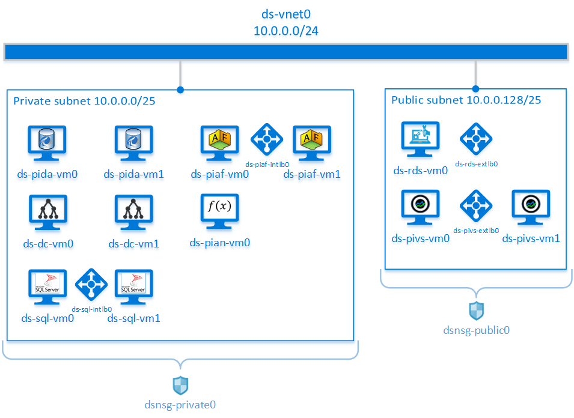

 

 # OSIsoft PI System on Azure
The PI System Deployment Sample for Azure are automated deployments that deploy the PI System on Microsoft Azure through Azure Resource Manager (ARM) templates and PowerShell Desired State Configuration (DSC) scripts. 

## Overview
This readme guide details a sample architecture for a PI System Deployment for Azure, how machines are interconnected and what software is installed. In addition, there are step-by-step instructions for deploying the PI System instance into an Azure subscription using the deployment samples. The deployment samples are available on the [OSIsoft GitHub repository for Azure](https://github.com/osisoft/OSI-Samples-PI-System/tree/master/PI-System-Deployment-Samples/Azure).

These deployment samples are intended for use by existing OSIsoft customers for the purpose of facilitating fast iterative testing and prototyping of a PI System deployment. As development environments move to the cloud, PI Admins need easy and quick ways to deploy resources for their testing cycles. The deployment samples provide an easy way to deploy a full PI System repeatedly and reliably for this type of development cycle. 
>**Note:** These deployment samples are not meant to be used within a production environment but rather for testing and prototyping purposes.  

The PI System Deployment Sample for Azure installs core PI System components such as PI Data Archive and PI Asset Framework. The template deploys a PI System that includes the following with an option for High Availability (HA) for the components indicated:
* Domain Controller (HA)
* SQL Server (HA)
* RDS box for remote access
* [PI Data Archive server](https://techsupport.osisoft.com/Products/PI-Server/PI-Data-Archive/Overview) (HA)
* [PI AF server](https://techsupport.osisoft.com/Products/PI-Server/PI-AF/Overview) (HA)
* PI Analysis Service
* [PI Vision](https://techsupport.osisoft.com/Products/Visualization/PI-Vision/Overview) (HA)

The deployment sample scripts create a virtual network divided into private and public subnets, the access to which is governed by associated Network Security Groups (NSGs). The deployment samples deploy all of the resources that comprise the PI System instance into these two subgroups, as shown in the following figures.

|   |
|:--:|
| *A Non-HA PI System Deployment on Azure* |

|   |
|:--:|
| *An HA PI System Deployment on Azure* |

### Costs and Licenses
You are responsible for the cost of the Azure services and resources used in association with the deployment samples.

You are encouraged to estimate the Microsoft Azure costs associated with the PI System deployment as part of your planning process. To assist with cost estimates, refer to the [Azure Pricing calculator page](https://azure.microsoft.com/en-ca/pricing/calculator/). Note that prices are subject to change. The deployment scripts include configuration parameters that you can customize. Note that changing some of these parameter values (e.g., vmSize) may affect the costs associated with the deployment. 

> **Tip:** After you deploy a PI System using the deployment samples, OSIsoft recommends that you download the Azure [billing invoice and daily usage data](https://docs.microsoft.com/en-us/azure/billing/billing-download-azure-invoice-daily-usage-date) regularly to track costs associated with the deployment samples. 

To use the deployment samples, you must be an existing OSIsoft customer and have access to the [OSIsoft Customer Portal](https://customers.osisoft.com). Access to the OSIsoft Customer Portal is required to download the necessary software, as well as to generate and download a full license for the PI System after the deployment. If you are new to the PI System, please reach out to us to request further information at the [OSIsoft Contact Page](https://www.osisoft.com/about-osisoft/contact-us/).

## Deployment Architecture for the PI System on Azure
The PI System Deployment Sample for Azure creates the following infrastructure:
* An Azure virtual network configured with public (external-facing front end) and private subnets (internal-only backend). 
* External and internal load balancers that distribute network traffic flow. Additionally, these load balancers redirect traffic with inbound network address translation (NAT) rules (e.g., rerouting a non-standard port that is externally exposed to the 3389 standard RDP port). 
* In the public subnet, a Remote Desktop Services (RDS) machine with Remote Desktop Protocol (RDP) access to the public and private subnets. 
* In the public subnet, a PI Vision web server (or a pair of web servers in an HA deployment) behind an external load balancer; the servers are for data visualization and are accessible via HTTPS.
* In the private subnet, a PI Data Archive server (or a pair of servers in an HA deployment) configured as a PI Data Collective per OSIsoft field service technical standards. 
* In the private subnet, a PI Asset Framework (AF) server (or a pair of servers in an HA deployment). Additionally, an Azure load balancer is deployed for this pair of PI AF servers.
* In the private subnet(s), a standalone dedicated PI Analysis Service server to carry out calculations.

## Deployment Procedures
This section contains step-by-step instructions for using the deployment samples to deploy a PI System and associated essential Azure infrastructure. 

### Prepare for the Deployment
There are a number of prerequisites that need to be met prior to launching the deployment samples. The following sections are procedures on how to meet these prerequisites. 

#### Create an Azure Account
Create a Microsoft Azure account if you do not already have one by visiting the [Create your Azure free account today page](https://azure.microsoft.com/en-us/free/) and following the instructions. Check that you can log into the [Azure portal](https://portal.azure.com) using your newly created account.

#### Download the Deployment Samples Files
The PI System Deployment Sample for Azure repository located on [OSIsoft GitHub repository for Azure](https://github.com/osisoft/OSI-Samples-PI-System/tree/master/PI-System-Deployment-Samples/Azure) contain templates, scripts and  files necessary to deploy the PI System and necessary Azure infrastructure. 

Download and extract the deployment sample files:
1. Go to the [OSIsoft GitHub repository for PI System Deployment Samples](https://github.com/osisoft/OSI-Samples-PI-System).
2. Click **Clone or Download** and then **Download Zip** to download the contents of this GitHub repository, and select the target location on your local machine.
3. Extract the **PI-System-Deployment-Samples** folder to your local machine.
4. After extracting the repository to a local folder, navigate to <extraction folder>\OSI-Samples-PI-System-master\PI-System-Deployment-Samples\Azure.

#### Download NuGet.exe
Download the `NuGet.exe` file in order to deploy a PI System instance on Azure. Browse to the [NuGet download page](https://www.nuget.org/downloads) and copy `nuget.exe` to the root of the Azure folder located in your extracted directory.

#### Download the PI System Files
Download the following PI System files to the **LocalArtifacts** folder on your local machine:
* PI Server install kit
* PI Vision install kit
* Temporary license file 
* PI System Deployment Tests zip file

>**Note:** The deployment sample will use the temporary PI license to deploy. After the deployment of the PI Data Archive(s), you will be able to generate a full PI license file through the OSIsoft Customer Portal using the Machine Signature File created from your deployed PI Data Archive(s).

>**Note:** Ensure you download and use the exact version of the PI Server (**PI Server 2018 SP3 Patch 3**) and PI Vision (**PI Vision 2020**) install kits described in this guide!

##### Download and Stage the PI Server Install Kit and Temporary License File
1. From the **Products** page on the [OSIsoft Customer Portal](https://my.osisoft.com), click on the product row for **PI Server**.
2. Click the **ALL VERSIONS** tab to display the **PI Server 2018 SP3 Patch 3** version of PI Server.
3. On the row corresponding to the **PI Server 2018 SP3 Patch 3** version of the install kit, click **Download** to display the **License and Service Agreements** page.
4. Agree to the **OSIsoft, LLC. (“OSIsoft”) Software License and Services Agreement** and click **Download**.
5. When prompted to run or save the executable setup file, click **Save** and click **OK**.
6. Locate your temporary PI license file and rename the file to **pilicense.dat**. If you do not have a temporary PI license, please contact OSIsoft Tech Support to obtain a 14-day temporary license for the deployment. OSIsoft Tech Support can be reached at the [ Customer Portal](https://my.osisoft.com).
7. Download the PI Server install kit and your renamed PI license file into the **LocalArtifacts** folder on your local machine.

##### Download and Stage the PI Vision Install Kit
1. From the **Products** page on the OSIsoft [Customer Portal](https://my.osisoft.com), click on the product row for **PI Vision**.
2. Select the **ALL VERSIONS** tab to display the **PI Vision 2020** version of PI Vision.
3. On the row corresponding to the **PI Vision 2020** version of the install kit, click **Download** to display the **License and Service Agreements** page.
4. Agree to the **OSIsoft, LLC. (“OSIsoft”) Software License and Services Agreement** and click **Download**.
5. When prompted to run or save the executable setup file, click **Save** and click **OK**.
6. Upload your PI Vision installer into the **LocalArtifacts** folder on your local machine.

##### Download and Stage the PI System Deployment Tests File
1. Go to the [OSIsoft GitHub repository for PI System Deployment Samples](https://github.com/osisoft/OSI-Samples-PI-System).
2. Click **Clone or Download** and then **Download Zip** to download the contents of this GitHub repository onto your local machine as a zip file. The deployment samples will configure and run the deployment tests for your environment.
3. Extract the **PI-System-Deployment-Tests** folder to your local machine.
4. Locate the folder called "PI-System-Deployment-Tests", right click on it and select "Send to > Compressed (zipped) folder". The filename should be PI-System-Deployment-Tests.zip.
5. Save this zip file onto your local machine in the **LocalArtifacts** folder. 

#### Verify You Have All of the Necessary Files
Verify that you have the necessary files and folders on your local machine. It should be similar to the following directory:

```
Unzipped folder (AzureDeployment)
|--> helpers 
|--> LocalArtifacts 
    |--> PI-Server_2018-SP3-Patch-3_.exe 
    |--> PI-Vision_2020_.exe
    |--> pilicense.dat 
    |--> UpdateAFServersUser.sql 
    |--> PI-System-Deployment-Tests.zip 
|--> LocalNugetPackages 
    |--> PSDSSupportPIDA.0.0.0.3.nupkg 
    |--> PSDSSupportPIVS.0.0.0.3.nupkg 
|--> nested 
|--> scripts 
|--> README.md 
|--> nuget.exe
```
#### Ensure Appropriate Licensing for SQL Server
The deployment samples require SQL Server to successfully deploy the PI System on Azure. Before deploying the PI System on Azure, you must ensure you have the appropriate licensing for SQL Server. You can do this by changing the license model for a SQL Server virtual machine (VM) in Azure by using the new SQL VM resource provider, Microsoft.SqlVirtualMachine.

There are two license models for a VM that's hosting SQL Server: pay-as-you-go and Azure Hybrid Benefit. You can modify the license model of your SQL Server VM by using the Azure portal, the Azure CLI, or PowerShell.

For more information on this, see [Change the license model for a SQL Server virtual machine in Azure](https://docs.microsoft.com/en-us/azure/virtual-machines/windows/sql/virtual-machines-windows-sql-ahb?tabs=azure-portal).

#### Install or Upgrade the AzureRM Cmdlets
AzureRM Cmdlets are a set of cmdlets for PowerShell that use the Azure Resource Manager (ARM) model for managing your Azure resources: the template uses them to deploy the Azure resources essential for your PI System. 
1. Launch PowerShell on your local machine as an Administrator.
2. Enter the following command: `PS C:\WINDOWS\system32> Install-Module -Name AzureRM -AllowClobber`.
This will install or (if you already have them installed) update your AzureRM Cmdlets.
3. Agree to **import** and install the nuget provider if prompted.
4. If prompted with **Are you sure you want to install the modules from 'PSGallery'**, agree to **Yes to All** by selecting `A`.
5. Close PowerShell.

### Launch the Deployment
Launching the PI System Deployment Sample for Azure will deploy a full PI System suitable for testing or development purposes using the PowerShell script `StarterScript.ps1`, helper scripts, ARM templates and necessary files. The deployment sample creates the necessary Azure infrastructure (i.e., servers, storage, networking and virtualization). The deployment sample installs and configures all PI System components via PowerShell DSC once the necessary pieces of Azure infrastructure is in place. 

1. Launch PowerShell on your local machine as **Administrator**.
2. Enter the following command: `PS C:\WINDWOWS\system32> Set-ExecutionPolicy RemoteSigned` and press **Enter**. This modifies the execution policy in order to run scripts. 
3. When prompted, confirm **Yes to All** by entering `A`.
4. In PowerShell, navigate to the **helpers** subfolder of the folder where you downloaded the PI System Deployment Sample for Azure files earlier. For example: `PS C:\WINDOWS\system32> cd "C:\Users\username\Azure\AzureDeploymentSamples\helpers"`.
5. Edit the file `StarterScript.ps1` and set the parameters to the appropriate values, i.e. `SubscriptionName` to your Azure subscription.
6. Enter the following command to launch the deployment: `PS C:\Users\username\Azure\AzureDeploymentSamples\helpers> .\StarterScript.ps1`. This script launches the PI System deployment on Azure using the parameters you specified in the `StarterScript.ps1` script. You will be prompted to log into your Azure account. PowerShell will attempt to connect to the specified Azure subscription.
7. When the **Microsoft Azure** sign-in screen appears, sign in with your Azure account that contains the desired subscription.
>**Note:** This sign-in screen may appear behind already open windows. Make sure to minimize all windows if you do not see this prompt!
8. Wait for the deployment process to complete. You can monitor the progress of the deployment by logging in to [Azure portal](https://portal.azure.com) and selecting the **Resource group** you provided and clicking **Deployments**. The status of all the deployments should be **Succeeded** and the PowerShell prompt on your local machine should have finished without any errors.

##### Script Parameters
 Parameter | Default | Description | Example
---|---|---|---
SubscriptionName | *Requires Input* | Name for Azure Subscription to use for the deployment | 
Location | WestUS | Location for the deployment | WestUS
ResourceGroupName | *Requires Input* | Name of the Azure Resource Group for the deployment | 
deployHA | true | Specifies whether to deploy an HA deployment ('true') or a non-HA deployment ('false') | false
EnableOSIsoftTelemetry | *Requires Input* | Sends telemetry information to OSIsoft for deployed PI products like the PI Server ('true'). | false
EnableMicrosoftTelemetry | *Requires Input* | Sends telemetry information to Microsoft for each deployed resource  ('true'). For additional information, please see [Micrsoft Documentation](https://docs.microsoft.com/en-us/azure/marketplace/azure-partner-customer-usage-attribution#add-a-guid-to-your-template). | false

### Verify the Deployment
There are a couple of ways to verify your PI System deployment for Azure was successful. The first is through examination of the new PI System instance. The second is examining the test results of the PI System Deployment Tests that run as part of the deployment process.

#### Verify the Deployment through the Azure Portal
1. Log into the [Azure portal](https://portal.azure.com/).
2. Click **Virtual machines** in the sidebar and select the internet-facing RDS machine from the list.
3. Select the RDS machine and select **Networking** in the sidebar under **Settings**.
4. Verify that an inbound rule exists for your IP Address to be able to remote into the RDS machine.
5. Click the Resource Group used to host the deployment.
6. Click on **Overview** to see the resources created during the deployment.
7. Click on the Key vault.
8. Click **Secrets** on the left vertical menu to access the secrets/passwords generated during deployment.
9. Click **ds-admin**.
10. Click the displayed GUID.
11. Copy the secret value. This contains the password of the ds-admin Administrator account needed to remotely access the RDS machine.
12. Connect to the RDS machine by clicking **Overview** in the sidebar and then clicking **Connect**.
Ensure you have the **RDP** selected in the right sidebar. Use the Domain Admin (ds-admin) account and the copied secret credentials from the previous steps. 
> **Note:** The domain name for the VMs is **DS**.
13. Remote login to the PI Data Archive machine(s) and verify data flow with the PI SMT application.
14. Open PI System Explorer and connect to the PI AF server machine(s) and verify attribute values.

#### Verify the PI System Deployment Test Results
Review the results of the PI System Deployment Tests performed during the automated deployment. 

To view the test results on the RDS:
1.	Log onto the RDS machine.
2.  Navigate to **C:\TestResults**.
3.	View the test results in your browser by double clicking one of the HTML result files.

### Replace the Temporary PI License with a Full PI License
A temporary PI license is used with the deployment samples since a full license requires an existing PI Data Archive.

Once the PI Data Archive(s) are fully deployed, you can generate a full PI license to replace this temporary PI license.

> **Note:** The temporary license file used during the initial deployment process **will expire** after 14 days. It is very important that you generate a full PI license to replace that temporary license file.

#### Generate a Full PI license:
1. Log into the primary PI Data Archive server machine.     
> **Note:** Create the Machine Signature File (MSF) on the server that is the primary member of the pair of PI Data Archive servers deployed. For more information on HA and collective members, see the *License a new PI Data Archive collective* section of the *PI Server Installation and Upgrade Guide*. You can find this guide on the OSIsoft [Customer Portal](https:\\my.osisoft.com).
2. Create an MSF using the pidiag utility on the PI Data Archive server machine. This utility is installed as part of your PI System deployment on the machine that hosts the PI Data Archive.
3. Copy the ds-admin password contained in the secret value from the Azure key vault.
4. Log into RDS machine using the copied password from the key vault.
5. Remote login to the PI Data Archive machine(s) from the RDS node using the same copied credentials.
6. Find and copy the MSF on the PI Data Archive machine(s) onto the RDS machine.
7. Generate the license file on the OSIsoft [Customer Portal](my.osisoft.com). For instructions on do this, see the *PI Server Installation and Upgrade Guide*, in the section [Generate a license file for a standalone deployment](https://livelibrary.osisoft.com/LiveLibrary/content/en/server-v12/GUID-0AE01ADF-771E-4BDA-B266-3C928BF79EBC). 

#### Replace the temporary license with the full PI license
1. Browse to the newly generated PI license in File Explorer and copy the license file.
2. Connect to the RDS machine with the **Administrator** username. Obtain the Administrator password by right-clicking on the RDS machine name and selecting the **Get Windows Password** option.
3. Paste the license file onto the RDS machine.
4. Copy the license file from the RDS machine.
5. Connect to the primary PI Data Archive server from the RDS machine using the private IP address. 
6. Obtain the password for the Administrator on the PI Data Archive by right-clicking on the PI Data Archive instance and selecting the **Get Windows Password** option.
7. Using File Explorer on the primary PI Data Archive server, paste the license file in the **%PISERVER%\dat** folder and ensure it is named **pilicense.dat**. 
8. Run a command prompt as administrator.
9. Go to the **%PISERVER%\adm** directory: **cd /d %PISERVER%\adm**.
10. Stop and start the PI server and associated services by running: **pisrvstop && pisrvstart**.

### Replace the Self-signed Certificate with a Trusted Certificate
OSIsoft strongly recommends using a digital certificate obtained from a trusted third-party Certification Authority (CA) or from your enterprise's private CA. It is recommended that you replace the self-signed certificate generated during the deployment of PI Vision with your trusted certificate. You can follow the instructions included in the following article to switch from the self-signed certificate to a custom certificate:
[Replacing a Self-Signed Certificate with a Trusted Certificate](https://customers.osisoft.com/s/knowledgearticle?knowledgeArticleUrl=KB01448)

### Feedback

To request a new sample, if there is a feature or capability you would like demonstrated, or if there is an existing sample you would like in your favorite language, please give us feedback at the OSIsoft GitHub Feedback Channel. To post feedback, submit feature ideas, or report bugs, use the **Issues** section of this GitHub repo. 

### Support

If your support question or issue is related to an OSIsoft product (error message, problem with product configuration, etc.), please open a case with OSIsoft Tech Support through the [OSIsoft Customer Portal](https://my.osisoft.com/).

If your support question or issue is related to a non-modified sample (or test) or sample documentation; please email [Samples@osisoft.com](mailto:Samples@osisoft.com). 

### License

The PI System Deployment Samples are licensed under the [Apache 2 license](https://github.com/osisoft/OSI-Samples-PI-System/blob/master/LICENSE).