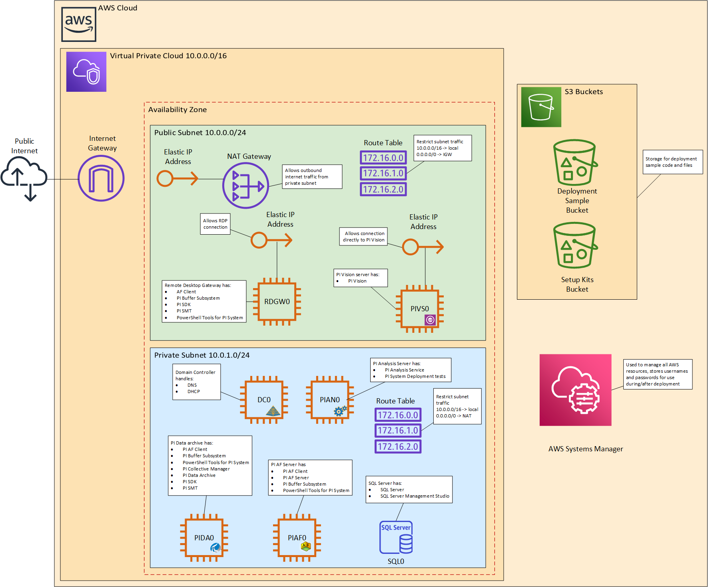
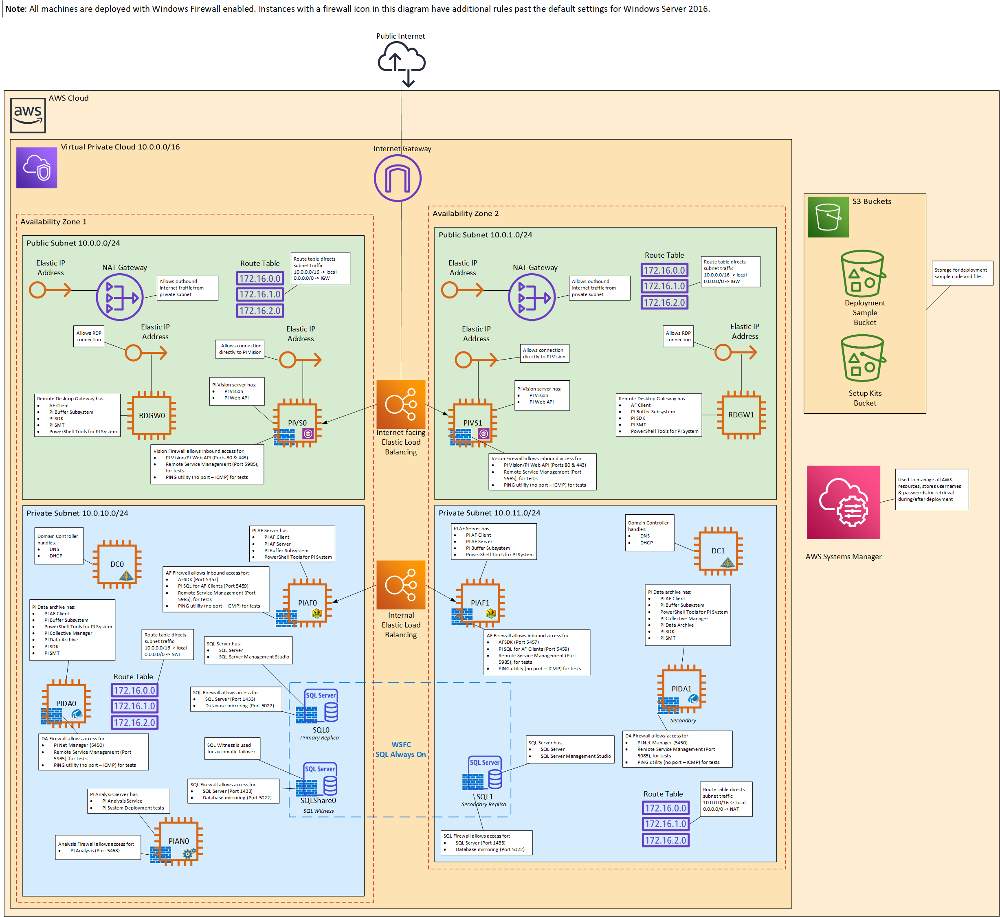

 
 
 # PI System Deployment Samples for Amazon Web Services

## OSIsoft PI System on Amazon Web Services Cloud
Amazon Web Services (AWS) provides a flexible, secure, affordable, and highly available cloud platform where you can take advantage of the OSIsoft PI System.

You can find the OSIsoft PI System Deployment Samples for AWS on the OSIsoft GitHub repository [here](https://github.com/osisoft/OSI-Samples-PI-System/DeploymentScripts/AWS).

PI System Deployment Samples for AWS are intended for use by existing OSIsoft customers to support quick and iterative testing and prototyping purposes. As development environments move to the cloud, PI Admins need easy and quick ways to deploy resources for their testing cycles. The PI System Deployment Samples provide an easy way to deploy a full PI System repeatedly and reliably to the AWS cloud for this type of development cycle. 

The deployment samples contains data storage, analytics, and visualization components of a standard PI stack deployment. This includes the PI Data Archive, PI Asset Framework (AF), PI Analysis Services and PI Vision. The deployment samples include the deployment Active Directory and Microsoft SQL Server which are PI System prerequisites. Per standard security practices, the environment is accessible via Remote Desktop Service EC2 instances.

You can also use the AWS CloudFormation templates as a starting point for your own implementation.

The deployment samples install core PI System components, such as PI Data Archive and PI Asset Framework. 

|  | 
|:--:| 
| *Non-HA Architecture Diagram* |

Optionally, the deployment sample supports the ability to deploy PI System in a High Availability (HA) configuration. Note that an HA deployment may be more advanced for first time users of PI System.

|  | 
|:--:| 
| *HA Architecture Diagram* |

With the high availability configuration, the PI System running on AWS takes advantage of dynamic capabilities of the AWS cloud allowing for scaling of compute EC2 types and storage needs as your PI system grows in scope and scale of data aggregation and analysis.

### Feedback

To request a new sample or if there is a feature or capability you would like demonstrated or there is an existing sample you would like in your favorite language, please give us feedback at the OSIsoft GitHub Feedback Channel. To post feedback, submit feature ideas, or report bugs, use the **Issues** section of this GitHub repo.
If you'd like to submit code for this Quick Start, please review the [AWS Quick Start Contributor's Kit](https://aws-quickstart.github.io/). 

### Support

If your support question or issue is related to an OSIsoft product (error message, problem with product configuration, etc.), please open a case with OSIsoft Tech Support through the [OSIsoft Customer Portal](https://my.osisoft.com/).

If your support question or issue is related to a non-modified sample (or test) or sample documentation; please email [Samples@osisoft.com](mailto:Samples@osisoft.com). 

### License

PI System Deployment Samples are licensed under the [Apache 2 license](https://github.com/osisoft/OSI-Samples/blob/master/LICENSE.md).

For the PI System Deployment Samples for AWS [Readme](./MasterStackReadme.md).