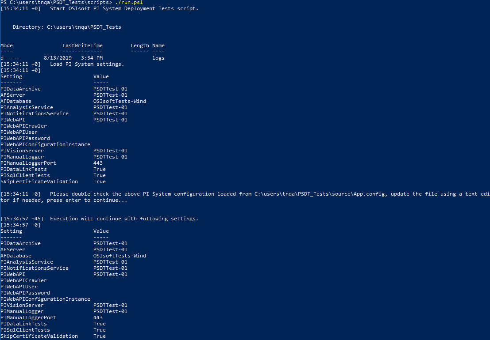

## Run the scripts and tests

Please review the [requirements](../Requirements.md) before executing the *Run.ps1* script.

**WARNING:** When you run the *Run.ps1* script, it asks if you want to remove all test components. If you have any PI points that have a point source of 'OSIsoftTests,' they will be deleted. The AF database referenced in the *App.Config* file will be removed as well. If you have an AF database with the same name as the one created by the test script, it will eventually be deleted.

### Execute the script

1. Launch PowerShell as administrator on the machine where the _PI-System-Deployment-Tests-master_ directory resides.

2. At the prompt, navigate to the *PI-System-Deployment-Tests-master\scripts* directory on the test client machine.

3. Type _.\Run.ps1_ and then press [ENTER].

    Depending on the current execution policies, PowerShell may block the script execution. Please follow the console messages to resolve any related issues.

	**Caution:** If you haven't set up the values for all required and optional PI System components in the *App.config* file, complete this prerequisite task before proceeding to step 4.
    
    

    Test logging occurs for every test run.  Log files are found in the *PI-Systems-Deployment-Tests-master\Logs* directory. Test results are created in the *\testResults* directory.

4. After ensuring the values in the *App.config* file reflect the names of your target PI System components, press [ENTER] to run the script.

    **Result:** The tests run.

    **Note:** Each time the script reruns, it checks if an AF Database (with the name defined in the *App.config* file) exists on the target AF Server. If it exists, you will be asked if you want to remove it and build another one from scratch.

5. After the tests have completed, the "*Remove all test components*" prompt appears. Perform one of the following actions at the prompt (see the warning above):

    * Type [Y] and then press [ENTER] to remove the existing AF database and all associated PI points and continue with script execution. Make sure to review the "Warning" at the beginning of this document before choosing this option.
    * Type [N] and then press [ENTER] to leave the existing AF database and end the script.

    **Result:** The "*PI System Deployment Tests finished.*" message displays.

### View test results

6. To view test results, navigate to the _\PI-System-Deployment-Tests-master\testResults_ folder and double-click the HTML file.

    **Result:** A summary of tests results by test class name are shown. Don't forget to check the reasons for any skipped tests in the Log Files. A skipped test may indicate that you do not have the latest version of a PI component.
    
    

## Run.ps1 script

The *Run.ps1* script checks that all required assemblies are available. Internet access is required to download the following assemblies:

- .NET developer pack (4.8)
- NuGet.exe (latest at www.nuget.org)
- MSBuild (v. 15 via Build Tools for Visual Studio)
- xUnit Console Runner (v. 2.4.1 via xunit.runner.console NuGet package)

The script also performs the following actions:

- Imports the AF database onto the target AF server using the *OSIsoftTests-Wind.xml* file from the *PISystemDeploymentTests\xml* directory.  Approximately 900 PI points are created on the target PI Data Archive.
- Compiles the xUnit tests with MSBuild. The compiled solution is placed in the *PISystemDeploymentTests\source* directory.
- Runs the Preliminary Checks to confirm that all PI System components are in place, running, and accessible.
- If the Preliminary Checks do not pass, the script exits and does not run any of the other tests.  If the script stops, fix any problems identified by the Preliminary Checks and then rerun the script. (See the "Log files" section for details on a script run.)

After the Preliminary Checks pass, all of the tests will run, including all required components and the optional components selected in the *App.config* file.

## Log Files

Each time the *Run.ps1* script runs, a log file is created and placed in the *Logs* directory. This log file lists the results of any Run script call.  It also shows the results of any test failures.

## Test Results

Test results display information about passed, failed, and skipped tests in an HTML file.  The Preliminary Checks results and general tests results are placed in two separate HTML files.

* Preliminary Checks test results are found in *\PI-System-Deployment-Tests-master\testResults\OSIsoftTests <date>@<time> PreCheck.html*.
* General test results are found in *\PI-System-Deployment-Tests-master\\testResults\OSIsoftTests <date>@<time> .html*.

### Skipped Tests

In the test results HTML file, any tests that were not run are listed under the Skipped Tests heading.  Skipped tests may indicate you do not have the latest version of a component. They can also occur when a certain optional feature of a PI System component is not installed on your target PI System.  When a script run includes a skipped test, additional information about the reason for the skip is included in the Log Files for that run.

## Run automated tasks with tests

You can use the following calls to run individual portions of the script:

| Expected Behavior                                            | Command                                               |
| ------------------------------------------------------------ | ----------------------------------------------------- |
| Import the AF database and create the PI points.             | .\run.ps1 -Setup or -s                                |
| Run another full set of tests after the test script runs (requires an existing AF database and PI points). | .\run.ps1 -Testing or -t                              |
| Run the tests from one test class (requires an existing AF database and PI points). Does not automatically execute the setup or Preliminary Checks. | .\run.ps1 -TestClass "MyTestClass"                    |
| Run an individual test (requires an existing AF database and PI points). Does not automatically execute the setup or Preliminary Checks. Using this option does not generate an HTML output file. | .\run.ps1 -TestClass "MyTestClass" -TestName "MyTest" |
| Remove the AF database and PI points created by the test script from the target PI system (see the warning above). | .\run.ps1 -Cleanup or -c                              |
| Run all the script steps (setup, testing, and cleanup), and respond "Y" to all prompts.  It also works with individual switch or switches. | .\run.ps1 -Force or -f                                |
| Run the testing step and respond "Y" to all prompts.         | .\run.ps1 -Testing -Force or -f                       |

##  Script Signature

The PowerShell script files are signed. To view these files you can open them using a text editor such as Notepad. Note: You cannot view the signature of the PowerShell script if it has been downloaded as part of a zip file from the GitHub repository.

If a script file is modified, the signing is no longer valid and the modifying party should apply their own signature text.

Return to the main [PI System Deployment Tests landing page](../../../).

