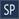
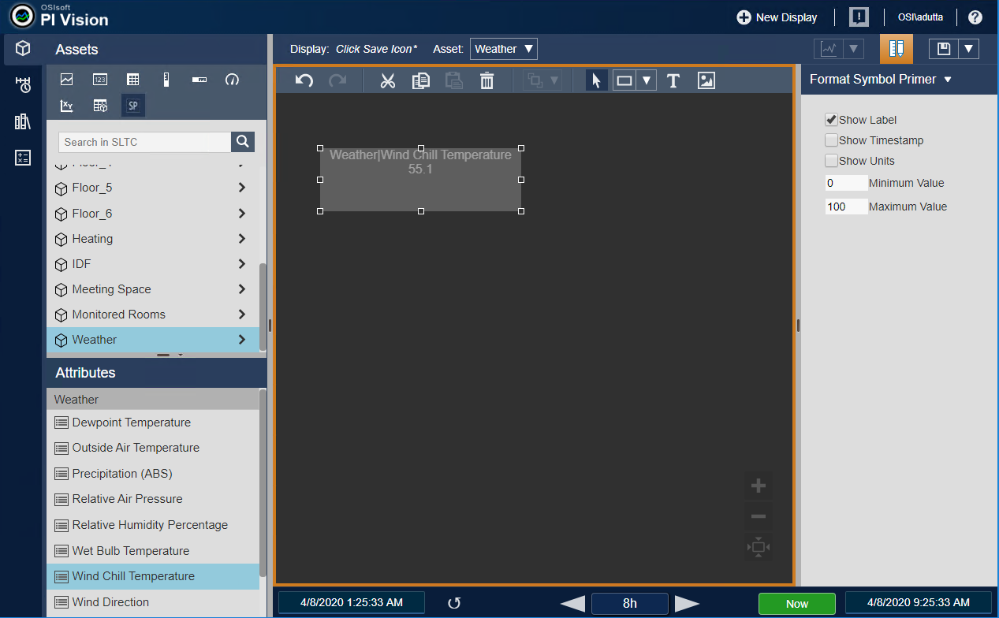

# Getting Started with PI Vision Extensibility

This document teaches you how to create a simple PI Vision extensibility symbol. The symbol accepts a single tag or attribute and displays its value, label, timestamp, and units. This symbol changes opacity based on the current value; the higher the value, the higher the opacity. In this way, a user will only see data as it becomes an issue. You can think of it as a multi-stated Value symbol that changes opacity instead of color. The goal of this document is to provide you with a fully functional extensibility symbol framework that you can easily modify to create new symbols that meet your business requirements.

## Create the directory folders
### Ext Folder and Icons Folder

1. Create the <code>ext</code> folder under the following path:

```
PIVISION_INSTALLATION_FOLDER\Scripts\app\editor\symbols\ext
```

2. Next, create the <code>icons</code> folder in the <code>ext</code> folder:
```
PIVISION_INSTALLATION_FOLDER\Scripts\app\editor\symbols\ext\icons
```

## Create the symbol files
### Presentation layer

The Presentation layer controls what the user sees in PI Vision. The Presentation layer for a custom symbol is basic HTML with AngularJS for data and configuration binding.

1. Create the presentation HTML file for the symbol in the `ext` folder and name it `sym-symbolPrimer-template.html`. Note that the name is important. PI Vision automatically looks for custom symbols based on this naming convention.
2. Add the following code to the file:

```html
<div class="SymbolPrimerLayout" ng-style="{opacity: config.Opacity, background: config.BackgroundColor, color: MultistateColor || config.TextColor}">
    <div ng-show="config.ShowLabel">{{label}}</div>
	<div>{{value}} <span ng-show="config.ShowUnits"> {{Units}}</span> </div>     
	<div ng-show="config.ShowTime">{{time}}</div>
</div>
```

### Configuration layer

The Configuration layer, much like the Presentation layer, is comprised of basic HTML with AngularJS for data binding and provides a way to configure the symbol's appearance.

1. Create the configuration HTML file for the symbol in the `ext` folder and name it `sym-symbolPrimer-config.html`.
2. Add the following code to the file:

```html
<div class="ConfigLayout">
    <label class="ConfigCheckBox">
        <input type="checkbox" name="ShowLabel" ng-model="config.ShowLabel">Show Label<br />
    </label>
    <label class="ConfigCheckBox">
        <input type="checkbox" name="ShowTime" ng-model="config.ShowTime">Show Timestamp<br />
    </label>
    <label class="ConfigCheckBox">
        <input type="checkbox" name="ShowUnits" ng-model="config.ShowUnits">Show Units<br />
    </label>
    <label class="ConfigText">
        <input class="ConfigTextBox" type="text" name="MinValue" ng-model="config.MinValue">Minimum Value<br />
    </label>
    <label class="ConfigText">
        <input class="ConfigTextBox" type="text" name="MaxValue" ng-model="config.MaxValue">Maximum Value<br />
	</label>
</div>
```

### Custom Style Sheet

The Custom Style Sheet (CSS) provides styling for the Presentation and Configuration layers.

1. Create the CSS file for the symbol in the `ext` folder and name it `sym-symbolPrimer.css`.
2. Add the following code to the CSS file:

```CSS
.ConfigLayout {
    padding: 15px;
    font-size: 14px
}
.ConfigCheckBox {
    display: flex;
    align-items: center;
    margin-top: 8px;
    margin-left: 15px;
    font-size: 14px;
}

.ConfigText {
    display: flex;
    align-items: center;
    margin-top: 8px;
    margin-left: 15px;
    font-size: 14px;
}

.ConfigTextBox {
    width: 50px;
}
```

### Symbol icon

You can add an icon for this symbol to the PI Vision symbol selector in the `Assets` pane. PI Vision uses a default symbol icon if a custom symbol is not available. 

1. Use your preferred image editor to create a 512 x 512 pixel image with a transparent background. 
2. Save the image as `sym-symbolPrimer.png` and copy the image into the `PIVISION_INSTALLATION_FOLDER\Scripts\app\editor\symbols\ext\Icons` folder. 

### Implementation layer

The JavaScript implementation file has four parts: 

* Definition 
* Registration 
* Initialization 
* Event handlers

1. Create a file to contain the symbol's implementation in the `ext` folder and name it `sym-symbolPrimer.js`.
2. Add the following code to the file. The file contents are explained below:

```javascript
(function(PV) {
    'use strict';

    function symbolPrimer() {}
    PV.deriveVisualizationFromBase(symbolPrimer);

    var definition = {
        typeName: 'symbolPrimer',
        datasourceBehavior: PV.Extensibility.Enums.DatasourceBehaviors.Single,
        iconUrl: 'scripts/app/editor/symbols/ext/icons/sym-symbolPrimer.png',
        supportsCollections: true,
        visObjectType: symbolPrimer,
        getDefaultConfig: function() {
            return {
                DataShape: 'Value',
                Height: 70,
                Width: 250,
                Opacity: "1.0",
                BackgroundColor: 'grey',
                TextColor: 'white',
                ShowLabel: true,
                ShowTime: false,
                ShowUnits: false,
                MinValue: 0,
                MaxValue: 100
            };
        },
        configTitle: 'Format Symbol Primer',
        StateVariables: ['MultistateColor']
    };

    symbolPrimer.prototype.init = function(scope, elem) {
        this.onDataUpdate = dataUpdate;
        this.onResize = symbolResize;
        this.onConfigChange = configChange;


        function dataUpdate(data) {
            if (data) {
                scope.value = data.Value;
                scope.config.Opacity = (data.Value - scope.config.MinValue) / (scope.config.MaxValue - scope.config.MinValue);
                scope.time = data.Time;
                if (data.Label) {
                    scope.label = data.Label;
                }
                if (data.Units) {
                    scope.Units = data.Units;
                }
            }
        }

        function symbolResize(width, height) {
            var SymbolContainer = elem.find('.SymbolPrimerLayout')[0];
            if (SymbolContainer) {
                SymbolContainer.style.width = width + 'px';
                SymbolContainer.style.height = height + 'px';
            }
        }

        function configChange(newConfig, oldConfig) {
            if (newConfig && oldConfig && !angular.equals(newConfig, oldConfig)) {
                if (!isNumeric(newConfig.MinValue) || !isNumeric(newConfig.MaxValue) || parseFloat(newConfig.MinValue) >= parseFloat(newConfig.MaxValue)) {
                    newConfig.MinValue = oldConfig.MinValue;
                    newConfig.MaxValue = oldConfig.MaxValue;
                }
            }
        }

        function isNumeric(n) {
            return n === '' || n === '-' || !isNaN(parseFloat(n)) && isFinite(n);
        }
    };

    PV.symbolCatalog.register(definition);
})(window.PIVisualization);
```

### Understanding the code

#### Symbol wrapper

The Implementation layer is wrapped in an immediately invoked function expression (IIFE). This function accepts a global PI Visualization object that is passed in as a parameter.

```javascript
(function(PV) {
    'use strict';

    function symbolPrimer() {}
    PV.deriveVisualizationFromBase(symbolPrimer);
})(window.PIVisualization);
```

#### Definition object

The definition property is a JSON object (key-value pairs) that sets default attributes for the symbol.

* `typeName`: This is the name of the symbol. It appears as a tooltip when you hover the mouse over the symbol's icon. 
* `datasourceBehavior`: Setting this property to `Single` allows you to drag and drop a single data item onto a display to create the symbol.
* `getDefaultConfig`: This property initializes the symbols default configuration. Updates to this property made by the Configuration layer are saved to the back-end database. When you reopen a saved display, it is initialized with the saved configuration. You should only make changes to this property with the Configuration layer.
* `DataShape`: This parameter tells the application server the information that this symbol needs to represent the data.
	* `Value`: Single value at a specific time
	* `Gauge`: Includes the ratio of a value between a minimum and a maximum
	* `Trend`: Multiple data source shape
	* `Table`:  Multiple data source shape that allows you to specify columns and sorting
* `configTitle`: This is the text for the configuration menu option that appears in the symbol's context (right-click) menu.
* `StateVariables`:  Setting this to`['MultistateColor']` enables multi-state source configuration.
* `supportsCollectons`: This indicates whether you can include the symbol as part of a collection symbol.
* `visObjectType`: This is the name of the function that was extended from `PV.deriveVisualizationFromBase`.

```javascript
var definition = {
    typeName: 'symbolPrimer',
    datasourceBehavior: PV.Extensibility.Enums.DatasourceBehaviors.Single,
    supportsCollections: true,
    visObjectType: symbolPrimer,
    getDefaultConfig: function() {
        return {
            DataShape: 'Value',
            Height: 70,
            Width: 250,
            Opacity: "1.0",
            BackgroundColor: 'grey',
            TextColor: 'white',
            ShowLabel: true,
            ShowTime: false,
            ShowUnits: false,
            MinValue: 0,
            MaxValue: 100
        };
    },
    configTitle: 'Format Symbol Primer',
    StateVariables: ['MultistateColor']
};
```

#### Initialization function

Use the Initialization function to set callback functions for the symbol. These drive the symbol's behavior. The function accepts scope and element parameters.

* `scope`: Provides access to PI Vision variables available to the symbol
* `elem`: Provides access to the HTML DOM element of the symbol's Presentation layer

```javascript
symbolPrimer.prototype.init = function(scope, elem) {

};
```

#### Event handlers

The custom symbol you have created defines event handlers (callback functions) to handle data update, resize, and configuration change events.

```javascript
this.onDataUpdate = dataUpdate;
this.onResize = symbolResize;
this.onConfigChange = configChange;
```

##### `onDataUpdate` callback

The PI Vision infrastructure calls this function any time a data update occurs. The properties on the object returned are determined by the `DataShape` specified in the `getDefaultConfig` function.

* Infrequently changed metadata values such as `label`, `units`, and `path` are contained in the first callback invocation and intermittently thereafter. The code checks to see if the `label` and `units` were provided prior to using them.
* The primer symbol sets the opacity for the Presentation layer based on the data value and the configured minimum/maximum. Use the PI Web API to obtain the `min` and `max` data item values.


```javascript
function dataUpdate(data) {
    if (data) {
        scope.value = data.Value;
        scope.config.Opacity = (data.Value - scope.config.MinValue) / (scope.config.MaxValue - scope.config.MinValue);
        scope.time = data.Time;
        if (data.Label) {
            scope.label = data.Label;
        }
        if (data.Units) {
            scope.Units = data.Units;
        }
    }
}
```

##### `onResize` callback

The PI Vision infrastructure calls this function when you resize the symbol.

* The HTML DOM element for the symbol (`elem`), which is passed into the Initialization function by PI Vision,  is used to find the symbol's container and then the container is resized.

```javascript
function symbolResize(width, height) {
    var SymbolContainer = elem.find('.SymbolPrimerLayout')[0];
    if (SymbolContainer) {
        SymbolContainer.style.width = width + 'px';
        SymbolContainer.style.height = height + 'px';
    }
}
```

##### `onConfigChange` callback

The PI Vision infrastructure calls this function any time you update the symbol configuration in the Configuration layer.

* The primer symbol uses this callback to validate the minimum and maximum values provided by the user in the Configuration pane.

```javascript
function configChange(newConfig, oldConfig) {
    if (newConfig && oldConfig && !angular.equals(newConfig, oldConfig)) {
        if (!isNumeric(newConfig.MinValue) || !isNumeric(newConfig.MaxValue) || parseFloat(newConfig.MinValue) >= parseFloat(newConfig.MaxValue)) {
            newConfig.MinValue = oldConfig.MinValue;
            newConfig.MaxValue = oldConfig.MaxValue;
        }
    }
}

function isNumeric(n) {
    return n === '' || n === '-' || !isNaN(parseFloat(n)) && isFinite(n);
}
```

### The symbol in PI Vision

We created an  icon for the symbol primer. PI Vision displays this icon in the Assets tool panel.

To use the symbol:

1. Click the  icon.
2. Navigate to an attribute with a numeric value.
3. Drag the attribute onto the display panel.
4. To display the configuration panel:
     1. Right-click the symbol to display the popup context menu.
     2. Click the "Format Symbol Primer" menu option.

 

## Addendum

### PI Web API HTTP request example

To make an HTTP request from a custom symbol, you need to use an AngularJS `$http` provider. The following example uses the `$http` provider to get the available AF servers. Depending on your CORS (Cross-Origin Resource Sharing) configuration, you may need to start Chrome with the `--disable-web-security` flag (debug testing only).

1. Inject an`$http` provider string into symbol definition.

```javascript
var definition = {
    inject: ['$http'],
};
```

2. Pass the `$http` provider as a parameter to the Initialization function.

```
symbolPrimer.prototype.init = function (scope, elem, $http) {

    };
```

3. Make a `GET HTTP` request for the list of all available asset servers and output results to the console.

```javascript
symbolPrimer.prototype.init = function(scope, elem, $http) {
    var baseUrl = PV.ClientSettings.PIWebAPIUrl;
    $http.get(baseUrl + '/assetservers').then(function(response) {
        console.log(response);
    });
};
```
