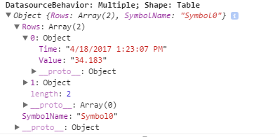

# PI Vision Extensibility Guide

<a id="top"></a>

Contents
========

* [Symbol extension](#1)
* [Layers of a PI Vision symbol](#2)
* [File layout](#3)
* [File naming convention](#4)
* [Before you begin](#5)
* [Implementation layer](#6)
* [Definition and registration](#7)
* [Initialization](#8)
* [Data shapes](#9)
* [Data updates](#10)
* [Presentation layer](#11)
* [Custom styles](#12)
* [Configuration layer](#13)
* [Configuration options](#14)
* [Symbol formats](#15)
* [Common format names](#16)
* [FormatOptions object](#17)
* [Symbol type switching](#18)
* [Upgrading from previous versions](#19)
* [PI Coresight 2016 to 2016 R2](#20)
* [PI Coresight 2016 R2 to PI Vision 2017](#21)
* [Tool pane extension](#22)
* [Layers of a PI Vision tool pane](#23)
* [File layout](#24)
* [Implementation layer](#25)
* [Badging](#26)

<a id="1"></a>
Symbol extension
================

You can extend your PI Vision installation to show data with custom symbols that aren’t available out of the box. This guide provides guidelines for adding custom symbols to your PI Vision installation. Your custom symbols will be available to any user browsing to the PI Vision server that hosts the custom symbol files described below.

[Back to top](#top)

<a id="2"></a>
Layers of a PI Vision symbol
----------------------------

PI Vision symbols have three major layers:

* [Implementation layer](#6)
* [Presentation layer](#11)
* [Configuration layer](#13)

The implementation layer is a JavaScript file that handles all of the symbol’s implementation logic. The presentation and configuration layers contain the HTML responsible for the symbol appearance and symbol configuration, respectively.

[Back to top](#top)

<a id="3"></a>
### File layout

You should save all files for a symbol except for the symbol image file in the same directory, in the`ext` folder, under:

`INSTALLATION\_FOLDER\Scripts\app\editor\symbols\`

The symbols image file should be stored in the `icons` folder under:

`INSTALLATION\_FOLDER\Scripts\app\editor\symbols\ext\icons`

If you have external library files, create a `libraries` subfolder under the `ext` folder and place the external library files in that subfolder.

[Back to top](#top)

<a id="4"></a>
### File naming convention

Symbol files should adhere to the following naming conventions:

* Required files
    * Implementation: `sym-YourSymbolName.js`
    * Presentation: `sym-YourSymbolName-template.html`
* Optional Files
    * Configuration: `sym-YourSymbolName-config.html`
    * CSS: `sym-YourSymbolName.css`

[Back to top](#top)

<a id="5"></a>
### Before you begin

Before you begin development, OSIsoft recommends that you place PI Vision into debug mode. To do so, edit the `web.config` file in your PI Vision installation folder to change the compilation tag, under `system.web`, from:

```
<compilation debug="false" targetFramework="4.8"/>
```

to

```
<compilation debug="true" targetFramework="4.8"/>
```

Debug mode disables the PI Vision bundling and minification system; this makes debugging your custom symbol easier.

Note that in debug mode, PI Vision does not process minified JavaScript files.

[Back to top](#top)

<a id="6"></a>
Implementation layer
--------------------

<a id="7"></a>
### Definition and registration

The JavaScript implementation file has three parts: definition, registration, and initialization.

As a best practice, you should wrap all PI Vision symbols in an immediately-invoked function expression (IIFE). An IIFE is a JavaScript function that is executed as soon as it is defined. The IIFE takes in the global PI Visualization object, which is passed in as a parameter.

```javascript
(function (PV) {
    'use strict';
})(window.PIVisualization);
```
<ol>
	<li>Create the visualization object, which you will build upon later.  </li>
	<li>Create a function as a container for your symbol. The function is extended via PI Vision helper functions to add default behaviors.</li>
	<li>Add the symbol registration.</li> 
	<li>Register your symbol with the PI Vision symbol catalog.</li>
	<ol type="a">
		<li>The implementation file looks like the code sample below after the previous steps:</li></ol></ol>

```javascript
(function (PV) {
    'use strict';

    function symbolVis() { }
    PV.deriveVisualizationFromBase(symbolVis);

})(window.PIVisualization);
```
<ol start="5">
	<li>Augment the registration with an actual symbol definition. </li>
	<ol type="a">
	<li>The definition object is a JSON object (key-value pairs) that sets defaults for the symbol. Possible settings in the object include:</li></ol></ol>

<table>
    <tr>
        <th>Parameter</th>
        <th>Value</th>
        <th>Notes</th>
    </tr>
    <tr>
        <td><code>typeName</code></td>
        <td>String</td>
        <td>Required. Internal unique name of the symbol.</td>
    </tr>
     <tr>
        <td><code>displayName</code></td>
        <td>String</td>
        <td>Optional. Name shown in the symbol picker menu. <code>typeName</code> is used if left blank.</td>
    </tr>
     <tr>
        <td><code>datasourceBehavior</code></td>
        <td>Number</td>
        <td>Optional. Mapping to the number of <code>datasources</code> the symbol accepts. Can be None, Single, or Multiple. If not specified, None is used.</td>
    </tr>
     <tr>
        <td><code>iconUrl</code></td>
        <td>String</td>
        <td>Optional. Path to the icon used on the symbol selector. If not specified, a default image is displayed on the symbol selector menu. This can be the path to any image file type that can be added to an HTML <code>&lt;img&gt;</code> tag.</td>
    </tr>
     <tr>
        <td><code>getDefaultConfig</code></td>
        <td>Function</td>
        <td>Optional. Function returning the default configuration to save in the database. A function used to specify the collection of parameters that should be serialized to the backend database. By convention, all properties should begin with an uppercase letter.</td>
    </tr>
     <tr>
        <td><code>loadConfig</code></td>
        <td>Function</td>
        <td>Optional. Returns true if the saved configuration should be merged into the default configuration. This function is used to upgrade a previous version of a symbol's configuration.</td>
    </tr>
     <tr>
        <td><code>templateUrl</code></td>
        <td>String</td>
        <td>Optional. Path to the presentation HTML file. If omitted, it looks in the current directory for a file named <code>sym-&lt;typeName&gt;-template.html</code></td>
    </tr>
     <tr>
        <td><code>configTemplateUrl</code></td>
        <td>String</td>
        <td>Optional. Path to the configuration HTML file. If omitted, it looks in the current directory for a file named <code>sym-&lt;typeName&gt;-config.html</code></td>
    </tr>
     <tr>
        <td><code>configTitle</code></td>
        <td>String</td>
        <td>Optional. Title for configuration. Used in the context menu when right-clicking the symbol and in the title of the configuration pane</td>
    </tr>
     <tr>
        <td><code>configOptions</code></td>
        <td>Function</td>
        <td><p>Optional. Controls what configuration options are available for this symbol. It takes in the symbol and returns an array of objects controlling configuration. The objects returned can contain:</p>
        <ul>
            <li><code>action</code>: Callback function to execute immediately.</li>
            <li><code>title</code>: Text that appears in the context menu when you right-click</li>
            <li><code>enabled</code>: Boolean when the menu item should be enabled.</li>
        </ul>    
</td>
    </tr>
     <tr>
        <td><code>configure</code></td>
        <td>Object</td>
        <td>Optional. Collection of key/ value pairs to be used on the configuration pane. This is mainly useful for holding static based configuration options, such as localization and for callbacks that you execute from the configuration pane markup referenced in <code>configTemplateUrl</code>.</td>
    </tr>
     <tr>
        <td><code>configInit</code></td>
        <td>Function</td>
        <td>Optional. Called when the configuration pane of a symbol is activated.</td>
    </tr>
     <tr>
        <td><code>StateVariables</code></td>
        <td>Array of Strings</td>
        <td>Optional. Properties that returns multistate information if configured. Setting this variable allows you to apply a multi-state to a symbol. The variable listed is added to the symbol's scope and available for data binding in HTML.</td>
    </tr>
     <tr>
        <td><code>resizerMode</code></td>
        <td>String</td>
        <td><p>Optional. The type of resizes the symbol should support. String used for determining how a symbols should resize. Options include:</p>
        <ul>
            <li><code>''</code>: Empty string. This allows a symbol to be resized in any direction. (Default)</li>
            <li><code>AutoWidth</code>: This allows a symbol's height to be resized while fitting the width. Used on text-based symbols.</li>
            <li><code>RetainAspectRatio</code>: This forces a symbol to be resized with the height and width staying proportional.</li>
        </ul>
</td>
    </tr>
     <tr>
        <td><code>inject</code></td>
        <td>Array of Strings</td>
        <td>Optional. A list of services that should be dependency injected into the init function. Default is empty array</td>
    </tr>
     <tr>
        <td><code>visObjectType</code></td>
        <td>Function</td>
        <td>Required. Object holding symbol specific functionality. Function that was extended from <code>deriveVisualizationFromBase</code></td>
    </tr>
     <tr>
        <td><code>noExpandSelector</code></td>
        <td>String</td>
        <td>Optional. CSS class name that determines if a popup trend does not show. Can be set to a CSS class of your choosing. By default, double-clicking on a symbol opens a popup trend. Adding this CSS class to a DOM element (or one of its parents) will prevent a popup trend from opening when you double-click on it.</td>
    </tr>
     <tr>
        <td><code>supportsCollections</code></td>
        <td>Boolean</td>
        <td>Optional. Indicates whether the symbol can be included as part of collection symbols. Default is false. In order for the symbol to be driven by the collection data sources, the symbol must use one of the built-in data shapes. See <a href="#9">Data shapes</a>.</td>
    </tr>
     <tr>
        <td><code>supportsDynamicSearchCriteria</code></td>
        <td>Boolean</td>
        <td>Optional. True if the symbol supports dynamic search criteria for assets. Default is false. Tables and Asset Comparison Tables allow you to determine the displays assets by providing search criteria. This flag enables this functionality.</td>
    </tr>
</table>


Use the `getDefaultConfig` function to specify the collection of parameters that you should serialize to the backend database. These are the parameters that your symbol needs to render properly. The resulting object returned by `getDefaultConfig` is placed on the symbol's scope property as config, for example, `scope.config`. Please note, by convention, all parameters should start with an upper-case letter.

The main parameter from getDefaultConfig that PI Vision system uses is `DataShape`. This parameter tells the application server the information that this symbol needs to represent the data. See [Data shapes](#9).

The datasourceBehavior property is determined by the following object, found in `\Scripts\app\common\PIVisualization.enumerations.js`:

```javascript
// Determines if a symbol can have 0, 1, or n number of datasources added to it.
// This does not affect adding datasources for multistating a symbol.
// This is redundant to the "symbol model" derived objects which also define this behavior;
// however, those classes are slated to be removed so that all symbols share the same model
// (then this setting becomes more important).
Enums.DatasourceBehaviors = Object.freeze({
    None: 0,
    Single: 1,
    Multiple: 2
});
```

Use the `datasourceBehavior` property to determine the types of data sources that you can use from the PI Vision search pane. Symbols that have this property set to `None` are considered static symbols and are not added to the symbol selector. Symbols that have this property set to `Single` allow you to drag and drop a single tag or attribute on the display to create that symbol. Symbols that have this property set to `Multiple` allow you to drag and drop multiple tags, attributes, or elements on the display to create that symbol.

Below is a sample definition object from the native PI Vision Value symbol:

```javascript
var def = {
        typeName: 'value',
        displayName: PV.ResourceStrings.ValueSymbol,
        datasourceBehavior: PV.Extensibility.Enums.DatasourceBehaviors.Single,
        iconUrl: 'Images/chrome.value.svg',
        getDefaultConfig: function () {
            var config = PV.SymValueLabelOptions.getDefaultConfig({
                DataShape: 'Value',
                Height: 56.5,
                Fill: 'rgba(255,255,255,0)',
                Stroke: 'rgba(119,136,153,1)',
                ValueStroke: 'rgba(255,255,255,1)',
                ShowTime: true,
                IndicatorFillUp: 'white',
                IndicatorFillDown: 'white',
                IndicatorFillNeutral: 'gray',
                ShowDifferential: true,
                DifferentialType: 'percent',
                ShowIndicator: false,
                ShowValue: true,
                ShowTarget: true,
                TextAlignment: 'left',
                FontSize: null,
                UseIntegerFontSize: false
            });
            return config;
        },
        themes: {
            reverse: {
                ValueStroke: 'black',
                IndicatorFillUp: 'black',
                IndicatorFillDown: 'black'
            }
        },
        loadConfig: loadConfig,
        configInit: configInit,
        templateUrl: 'scripts/app/editor/symbols/sym-value-template.html',
        resizerMode: 'AutoWidth',
        StateVariables: ['Fill', 'Blink'],
        inject: ['symValueLabelOptions'],
        visObjectType: valVis,
        configTemplateUrl: 'scripts/app/editor/symbols/sym-value- config.html',
        configTitle: PV.ResourceStrings.FormatValueOption,
        formatMap: {
            BackgroundColor: 'Fill', 
            TextColor: 'Stroke',
            ValueColor: 'ValueStroke', 
            TextResize: 'TextResize',
            Alignment: 'Alignment'
        },
        setAlignment: setAlignment,
        updateHeight: updateHeight,
        supportsCollections: true
    };
```

[Back to top](#top)

<a id="8"></a>

### Initialization

The final part of the symbol implementation is the `init` function. The `init` function is defined on the prototype of the symbol container object created in `deriveVisualizationFromBase`.

```javascript
symbolVis.prototype.init = function (scope, element) {
```

The `init` function takes two parameters (`scope` and `element`) and optionally sets callback functions (such as data updates and resize events) on the symbol container object to drive the symbol.

Callback functions set inside the init function:

* `this.onDataUpdate`: This function is called by the PI Vision infrastructure any time a data update occurs. It takes in a data object that contains the `Value`, `Time`, `Path`, `Label`, `Units`, `Description`, etc. The properties on the object returned are determined by the `DataShape` specified in the `getDefaultConfig` function.
* `this.onResize`: This function is called by the PI Vision infrastructure anytime the symbol is resized. The resize function is passed the new width and height of the symbol.
* `this.onConfigChange`: This function is called by the PI Vision infrastructure anytime the configuration of a symbol is updated. It takes in the new configuration and the old configuration.
* `this.onDestroy`: This function is called by the PI Vision infrastructure when the symbol is destroyed.

Here is an example `init` function definition:

```javascript
(function (PV) {
    'use strict';

    function symbolVis() { }
    PV.deriveVisualizationFromBase(symbolVis);

    symbolVis.prototype.init = function (scope, element) {
        this.onDataUpdate = dataUpdate;
        this.onConfigChange = configChanged;
        this.onResize = resize;

        function dataUpdate(data) {
            // ...
        }

        function configChanged(newConfig, oldConfig) {
            // ...
        }

        function resize(width, height) {
            // ...
        }
    };

    var def = {
        // ...
    };
    PV.symbolCatalog.register(def);
})(window.PIVisualization);

```

Example `dataUpdate` function:

```javascript
function dataUpdate(data) {
    if(data) {
        scope.value = data.Value;
        scope.time = data.Time;
        if(data.Label) {
            scope.label = data.Label;
        }
    }
}
```

Example `configChanged` function:

```javascript
function configChanged(newConfig, oldConfig) {
    if (newConfig && oldConfig && !angular.equals(newConfig, oldConfig)) {
        showLabels(scope.Width, scope.Height);
    }
}
```

Example `resize` function:

```javascript
function resize(width, height) {
    if (chart) {
        chart.setSize(width, height);
    }
}
```

[Back to top](#top)

<a id="9"></a>

### Data shapes

The `getDefaultConfig` function in the symbol definition can include a `DataShape` field to define how PI Vision should retrieve data.

The returned data can contain metadata for infrequently changed values. This includes the `Label`, `Units`, and `Path` values.

#### Value

A Value is a single data source shape that is used by the PI Vision Value symbol. It is a single value at a specific time.

##### Example Data returned to `onDataUpdate` when `DataShape` equals `Value` and `datasourceBehavior` equals `DatasourceBehaviors.Single`

**Without metadata**


**With metadata**


##### Example data returned to `onDataUpdate` when `DataShape` equals `Value` and `datasourceBehavior` equals `DatasourceBehaviors.Multiple`

The Value data shape doesn't support multiple data sources. These settings will produce the same results as with `CS.Extensibility.Enums.DatasourceBehaviors.Single`. Only the first data stream dropped on the symbol is returned in the data object.

#### Gauge

A Gauge is a single data source shape that is used by the PI Vision Gauge and Bar symbols. This includes the ratio of a value between a minimum and a maximum. The following configuration options are set as fields on the symbol's config object and are used to show a gauge symbol:

* `Start`: Numeric value for zero on the scale. Defaults to 0 if setting is not present. No default.
* `ValueScale`: Return ValueScaleLabels and ValueScalePositions in the data update. Default = true
* `ValueScaleSetting`: An object with these fields:
    * `MinType`: 0 = Autorange, 1 = Use data item definition (default), 2 = Absolute
    * `MinValue`: If MinType is 2, the numeric value of the bottom of the scale
    * `MaxType`: 0 = Autorange, 1 = use Data item definition (default), 2 = Absolute
    * `MaxValue`: If MaxType is 2, the numeric value of the top of the scale

##### Example data returned to `onDataUpdate` when `DataShape` equals `Gauge` and `datasourceBehavior` equals `DatasourceBehaviors.Single`

**Without metadata**


**With metadata**


##### Example data returned to `onDataUpdate` when `DataShape` equals `Gauge` and `datasourceBehavior` equals `DatasourceBehaviors.Multiple`

The Gauge data shape only supports a single data source. These settings will produce the same results as with `CS.Extensibility.Enums.DatasourceBehaviors.Single`. Only the first data stream dropped on the symbol is present in the returned data object.

#### Trend

A Trend is a multiple data source shape that is used by the PI Vision Trend symbol. These options are available on the configuration object:

* `Markers`: If true, request recorded values instead of plot values if the time range is short enough. Note that markers are only shown if there is enough width to show them and the time range returns markers.
* `MultipleScales`: If true, each trace is scaled independently; otherwise, all traces share one scale.
* `TimeScaleType`: Controls labels on the time scale. 0 = Start, End and Duration; 1 = Timestamps; 2 = Relative to end; 3 = Relative to start
* `ValueScaleSetting`: See the Gauge symbol configuration object above. Defaults are 0, Autorange.

You can set the `FormatType` independently for each trace by including them in a `TraceSettings` array.

##### Example data returned to `onDataUpdate` when `DataShape` equals `Trend` and `datasourceBehavior` equals `DatasourceBehaviors.Single`

This configuration results in the same data object as with `CS.Extensibility.Enums.DatasourceBehaviors.Multiple`; however, the `Traces` array is limited to only one element.


##### Example data returned to `onDataUpdate` when `DataShape` equals `Trend` and `datasourceBehavior` equals `DatasourceBehaviors.Multiple`

**Without metadata**


**With metadata**


#### Table

A Table is a multiple data-source shape that is used by the PI Vision Table symbol. When you use the Tables shape, you can specify the following options on the configuration object:

* `Columns`: Array of strings. Can include `Value`, `Trend`, `Average`, `Minimum`, `Maximum`, `StdDev`, `Range`, or `pStdDev`
* `SortColumn`: Column on which to sort results
* `SortDescending`: True to reverse sort order

##### Example data returned to `onDataUpdate` when `DataShape` equals `Table` and `datasourceBehavior` equals `DatasourceBehaviors.Single`

This configuration will result in the same data object as with `CS.Extensibility.Enums.DatasourceBehaviors.Multiple`; however, the `Rows` array is limited to only one element.


##### Example data returned to `onDataUpdate` when `DataShap`e equals `Table` and `datasourceBehavior` equals `DatasourceBehaviors.Multiple`

**Without metadata**



**With metadata**


#### TimeSeries

A multiple data source shape that returns raw data values. These options are available on the configuration object and apply to each returned data source being returned:

* `DataQueryMode`: This specifies the type of query to perform. All valid values can be found under the object `DataQueryMode` (reference scripts/common/`PIVisualization.enumerations.js`). The default is `ModeEvents`. Here are a few of the common ones:
    * `ModeEvents`: Returns archived values
    * `ModeSingleton`: Returns the snapshot value
    * `ModePlotValues`: Returns data suitable for plotting over a specified number of intervals. Intervals typically represent the pixels of the screen width.
    * `ModeMarkers`: Returns archived values, up to the limit set on the server (typically 400 values). Automatically falls back to `PlotValues` if the threshold is exceeded
    * `Intervals`: Used in connection with a request for `PlotValues` and typically represents the pixels of the screen width

##### Example data returned to `onDataUpdate` when `DataShape` equals `TimeSeries` and `datasourceBehavior` equals `DatasourceBehaviors.Single`

This configuration results in the same data object as with `CS.Extensibility.Enums.DatasourceBehaviors.Multiple`; however, the Data array is limited to only one PI tag or AF element.


##### Example data returned to `onDataUpdate` when `DataShape` equals `TimeSeries` and `datasourceBehavior` equals `DatasourceBehaviors.Multiple`

**Without metadata**


**With metadata**


#### Configuring number and date formats

The configuration settings returned by the `getDefaultConfig` function can include the `FormatType` field to control the format of numbers and dates displayed in a symbol.

If this setting is not present or not null, numbers and dates are formatted using the thousands separator, decimal separator, and date format for the primary language of the browser or the client operating system. Dates are adjusted to the time zone of the browser unless you override them in a URL parameter or by a global server setting.

If set to `Database`, the `DisplayDigits` setting in the PI Data Archive point definition is used to control precision. If you set it to `Scientific`, numbers are shown in exponential notation.

You can use any other standard or custom string supported by Microsoft C# to control precision and leading or trailing zeroes, with special formats for currency, percentages and negative numbers. See Microsoft MSDN article [C# Numeric Format Strings](https://docs.microsoft.com/en-us/dotnet/standard/base-types/standard-numeric-format-strings?redirectedfrom=MSDN).

If you set `FormatType` to `null`, numbers are returned in invariant format without the thousands separator and with the period as the decimal separator. Dates are returned in the ISO 8601 format `YYYY-MM-DDThh:mm:ss.fffZ`.

[Back to top](#top)

<a id="10"></a>
### Data updates

Based on the symbol's configuration and its datasources, PI Vision requests data and calls the `dataUpdate` method that is defined when the symbol is initialized. The object passed to this function depends on the symbol's `DataShape`.

#### Metadata

Some properties of a data item change infrequently, such as the data item name or its unit of measure. To reduce the response size and improve performance, these metadata fields are returned on the first request and only periodically afterward. The symbol update code should only process updates for the following fields if they actually exist in the response:

* `Path`
* `Label`
* `Units`
* `DataType` (Included if configuration object has `DataType` set to `true`)
* `Description` (Included if configuration object has `Description` set to `true`)

#### Error fields

If data cannot be retrieved for a data item, the `IsGood` field is added to the response, is set to false, and the `ErrorCode` and `ErrorDescription` fields include specifics about the error.

<table>
    <tr>
        <th><code>DataShape</code></th>
        <th><code>dataUpdate</code> Parameter Properties, plus <code>Metadata</code> and <code>Error</code> fields</th>
    </tr>
    <tr>
        <td><code>Value</code></td>
        <td>
        <ul>
            <li><code>Value</code></li> 
            <li><code>Time</code></li>
        </ul>
        </td>
    </tr>
    <tr>
        <td><code>Gauge</code></td>
        <td><ul>
            <li><code>Value</code></li> 
            <li><code>Time</code></li>
    <ul>
        <li><code>Indicator</code>: Current value as a percentage of Max - Min, between 0 and 100 </li>
        <li><code>StartIndicator</code>: The value of Start as a percentage of Max - Min, 0 to 100 </li>
        <li><code>ValueScaleLabels</code>: Array of scale labels</li>
        <li><code>ValueScalePositions</code>: Array, position of labels between Min and Max, 0 to 100</li>
    </ul> 
    </ul>
</td>
    </tr>
    <tr>
        <td><code>Trend</code></td>
        <td><p><code>StartTime</code>, <code>EndTime</code>, <code>Duration</code></p> 
            <ul>
                <li><code>TimeScaleLabels</code>: Array of scale labels</li>
                <li><code>TimeScalePositions</code>: Array, position of gridlines between Min and Max, 0 to 100</li> 
                <li><code>ValueScaleLabels</code>: Array of scale labels</li>
                <li><code>ValueScalePositions</code>: Array, position of labels between Min and Max, 0 to 100</li> 
                <li><code>Traces</code>: Array of objects with these fields:</li>
                <ul>
                    <li>Metadata and error fields</li>
                    <li>Value</li>
                    <li><code>LineSegments</code>: Array of trace points in 100x100 coordinate space, origin lower left</li>
                    <li><code>ErrorMarkers</code>: Coordinates of data errors or where traces go out of bounds</li> 
                    <li><code>Markers</code>: True if points are for recorded values</li>
                    <li><code>ScaleMin</code> or <code>ScaleMax</code>: Scale labels if multiple scales are requested </li>
                    <li><code>Stepped</code>: If true, data item is stepped</li>
                </ul>
            </ul>    
</td>
    </tr>
    <tr>
        <td><code>Table</code></td>
        <td>
        <ul>
            <li><code>Rows</code>: Array of objects with these fields: </li>
            <ul>
                <li>Metadata, error fields</li>
                <li><code>Trend</code>: Array of trace points in 100x100 coordinate space, origin lower left </li>
                <li><code>Summary</code>: Array of requested statistical columns</li>
            </ul>    
        </ul>
            </td>
    </tr>
    <tr>
        <td><code>TimeSeries</code></td>
        <td>
        <ul>
            <li><code>Data</code>: Array containing data objects for each individual data source associated with the symbol. Each item can contain the fields:</li>
            <ul>
                <li>Metadata, error fields</li>
                <li>Value array</li>
                <ul>
                    <li><code>Time</code></li>
                    <li><code>Value</code></li>
                </ul>
            </ul>
        </ul>    
            </td>
    </tr>
</table>    


[Back to top](#top)

<a id="11"></a>
Presentation layer
------------------

The presentation layer for a custom symbol is basic HTML with AngularJS for data and configuration binding. The presentation layer is defined by the symbol's templateUrl property in the definition.

Here is example HTML code for a symbol:

```html
<div id="outer" 
     style="'position': 'relative'; width:100%; height:100%; border:1px solid white;">
    <div id="inner" 
         ng-style="{'background':config.Fill, 'width':innerWidth, 'height':innerHeight, bottom: '-1px', left: '1px', 'position': 'absolute'}">
    </div>
</div>
```

The example symbol is made up of two `div` elements: the outer `div` for the border and the inner `div` to show the data. The majority of the work is handled by AngularJS in the inner `div`. This `div` has an ng-style attribute, which is AngularJS's way of setting styles.

In the ng-style, PI Vision sets the background color to be whatever is configured for the symbol's fill. This was originally defined in the `getDefaultConfig` function. The height and width are also set based on variables defined on the symbol's scope in the `init` or the `dataUpdate` functions.

[Back to top](#top)

<a id="12"></a>
### Custom styles

You can add custom CSS files to provide styling for symbols. Place CSS files in the same directory as the symbol, `\Scripts\app\editor\symbols\ext\`. The files should follow the naming convention of `sym-<YourSymbolName>.css`. Note that custom CSS files placed in this directory are subject to overrides by the application styles. If a custom style selector has the same target and specificity as another style in the application, the custom style may not be applied. You should not use CSS styles added to this directory for application theming.

When writing styles for custom symbols, you should choose unique selectors; however, avoid using `id` attributes as they are not meant to be duplicated.

The most convenient way to signify a specific style target is through the use of unique class selectors:

```css
<div class="my-custom-symbol">
    <span>Symbol Content</span>
</div>
```

Styles can then target this symbol without interfering with other parts of the application:

```css
.my-custom-symbol {
  color: blue;
}
```
[Back to top](#top)

<a id="13"></a>
Configuration layer
-------------------

The configuration layer, much like the presentation layer, is basic HTML with AngularJS for data binding. The configuration layer is defined by the symbol's `configTemplateUrl` property in the definition.

The configuration options are shown on the symbol's context menu, via right-click or long press on a touch-enabled device.

The example configuration HTML for a symbol below is defined in a file following the configuration naming convention of `sym-YourSymbolName-config.html`:

```html
<div class="c-side-pane t-toolbar">
    <span style="color:#fff; margin-left:15px">{{::def.configure.orientationKeyword}}</span>
</div>

<div class="c-config-content">
    {{::def.configure.orientationKeyword}}
    <select ng-model="config.Orientation">
        <option value="Horizontal">{{::def.configure.horizontalKeyword}}</option>
        <option value="Vertical">{{::def.configure.verticalKeyword}}</option>
    </select>
</div>
```

The title of the configuration pane is the value set in the `configOptions` for `title`. This is also what is shown on the context menu when you launch the configuration pane.

The first `div` element sets the section title block in the configuration pane. AngularJS's binding syntax is used to set the text based on a string set in the symbol's configure object.

The second `div` contains the selection menu for choosing the orientation of the symbol. This is just a basic HTML select with options. The option text is based on a string set in the symbol's configure object and bound using AngularJS syntax.

The important part of this section is the ng-model attribute. This is used to bind the value set in the configuration pane back to the symbol itself.

[Back to top](#top)

<a id="14"></a>
### Configuration options

A symbol can define the entries in a context menu that is shown when the symbol is right-clicked or after a long press with a touch-enabled device. The options are defined in the symbol definitions `configOptions` function. This function is called when the menu is opened so the list of options can be dynamically populated based on the state of the symbol that was clicked.

Here is an example of how to program the context menu:

```javascript
configOptions: function (context, clickedElement) {
    var options = [{
        title: 'Configure My Symbol', 
        mode: 'configureMySymbol'
    }, {
        'separator'
    }, {
        title: 'Hide',
        action: function (context) { 
            context.def.configure.hide(context.symbol); 
        }
    }];

    return options;
}
```

The first parameter passed into this function is the context object which has fields that describe the current symbol:

* **symbol**: `symbol`
* **config**: `symbol.Configuration`
* **runtimeData**: `runtimeData`
* **def**: `runtimeData.def`

The second parameter is the DOM element that was clicked or touched to open the context menu.

The first option opens the configuration pane using the symbol's configuration template. The mode property causes the configuration pane to stay open if another symbol on the display is selected that supports the same mode.

The second option draws a separator line in the context menu.

The third option defines an immediate action that invokes a function defined on the symbol's `configure` object in the definition.

[Back to top](#top)

<a id="15"></a>
Symbol formats
--------------

This section describes standardized format names, conventions, and their usage for PI Vision symbols. The purpose of a standardized symbol format is to:

* Enable a symbol to share formats with other symbols 
    * For example, when a symbol type is switched to another symbol type or a format paint brush feature is applied to the symbol, etc.
* Support forward compatibility 
    * For example, the ability to open/edit displays from prior PI Vision versions with formats that they were saved with

PI Vision supports switching a symbol from one type to another supported type (for example, Value to LinearGauge). Standard format options and options common to a symbol family are preserved when changing types. The addition of a new object called `FormatOptions` to the symbol configuration object allows you to define anything format related that you want to participate in any format copying that PI Vision has now or will provide in the future.

[Back to top](#top)

<a id="16"></a>
### Common format names 

The list below provides the standard format names used to share formats between symbols:

<table>
    <tr>
        <th>Format Name</th>
        <th>Description</th>
    </tr>
    <tr>
        <td><code>TitleColor</code></td>
        <td>Color of title text</td>
    </tr>
    <tr>
        <td><code>TitleSize</code></td>
        <td>Size of title text</td>
    </tr>
    <tr>
        <td><code>TitleFont</code></td>
        <td>Font of title text</td>
    </tr>
    <tr>
        <td><code>TitleBackgroundColor</code></td>
        <td>Background color of title text</td>
    </tr>
    <tr>
        <td><code>TitleAlignment</code></td>
        <td>Alignment for title text</td>
    </tr>
    <tr>
        <td><code>TextColor</code></td>
        <td>Color of text</td>
    </tr>
    <tr>
        <td><code>TextSize</code></td>
        <td>Size of text</td>
    </tr>
    <tr>
        <td><code>TextFont</code></td>
        <td>Font of text</td>
    </tr>
    <tr>
        <td><code>TextBackgroundColor</code></td>
        <td>Background color of text</td>
    </tr>
    <tr>
        <td><code>TextAlignment</code></td>
        <td>Alignment of text</td>
    </tr>
    <tr>
        <td><code>BackgroundColor</code></td>
        <td>Background color of symbol</td>
    </tr>
    <tr>
        <td><code>LineColor</code></td>
        <td>Color of line/border</td>
    </tr>
    <tr>
        <td><code>LineWidth</code></td>
        <td>Width of line/border</td>
    </tr>
    <tr>
        <td><code>LineDashType</code></td>
        <td>Style of line/border</td>
    </tr>
    <tr>
        <td><code>ValueColor</code></td>
        <td>Color of value shown in the symbol</td>
    </tr>
</table>

[Back to top](#top)

<a id="17"></a>
### FormatOptions object 

To make it easy to share formats between symbols, a new object called `FormatOptions` (which is a collection of formats) is created as one of the collection properties returned by `getDefaultConfig`. The `FormatOptions` object can contain as properties either standard format names or custom names. Any format that is part of this object is automatically shared when a symbol is switched to another allowed type or for future format sharing features. 

**Note:** Starting with PI Coresight 2016 R2, all newly created symbols should use the `FormatOptions` object exclusively for storing format properties; maps are only used for existing symbols with already defined format properties.

**Example code**:

```javascript
var def = {
    getDefaultConfig: function () {
        return {
            DataShape: 'Gauge',
            Height: 200,
            Width: 200,
            FormatOptions: {
                TextColor: 'rbg(0,123,127)',
                LineWidth: 12
            }
        };
    }
};
```

#### Forward compatibility 

Symbol formats of displays created or saved in versions prior to PI Coresight 2016 R2 use different format names for common formats that need to be shared between symbols. For the sake of forward compatibility, these names are kept intact and a `formatMap` object is used to map them to common format names or symbol specific names that are shared between particular symbols. This `formatMap` object is defined as a property of the symbol `definition` object.

**Example code**:

```javascript
var def = {
    getDefaultConfig: function () {
        return PV.SymValueLabelOptions.getDefaultConfig({
            DataShape: 'Gauge',
            Height: 200,
            Width: 200,

            FaceAngle: 270,
            IndicatorType: 'arc',
            IndicatorWeight: 2,
            BorderWidth: 3,

            IndicatorColor: 'rgb(0, 162, 232)',
            FaceColor: 'rgba(0, 0, 0, 0)',
            BorderColor: '#fff',
            ScaleColor: '#fff',
            ValueColor: '#fff',

            ScaleLabels: 'all',
            LabelLocation: 'bottom',
            FormatOptions: {
                TitleColor: 'rbg(0,123,127)',
                TitleSize: 12
            }
        });
    },
    formatMap: {
        GaugeBackgroundColor: 'FaceColor',
        LineColor: 'BorderColor',
        LineWidth: 'BorderWidth',
        TextColor: 'ScaleColor'
    }
};
```

[Back to top](#top)

<a id="18"></a>
### Symbol type switching 

Once created, you can switch PI Vision symbols into other supported types. For example, you can switch a Trend symbol into a Table symbol type and vice versa and you can switch a Value symbol into any Gauge symbol type and vice versa. When a symbol switch happens, all matching formats from the defined `formatMap` and all formats in the `FormatOptions` object are copied from the source type to the destination type. For example, when a Value symbol is switched to a Gauge symbol type, the `ValueColor` format is copied to the Gauge symbol. The Value symbol type has no defined `FormatOptions` object.

#### `symbolFamily` property

A symbol definition can define a property called `symbolFamily`. If the source and destination types of switched symbols belong to the same `symbolFamily` (for example, `VerticalGauge` and `HorizontalGauge` both belong to the same `symbolFamily` called "gauge"), then all formats defined in the `formatMap` along with all formats in the `FormatOptions` from the source type are copied to the destination type.

[Back to top](#top)

<a id="19"></a>
Upgrading from previous versions
--------------

The following sections describe changes that have been made between previous releases. Unless otherwise indicated, these updates are required for all later versions as well. For example, the changes listed in [PI Coresight 2016 to 2016 R2](#20) will also apply if upgrading from PI Coresight 2016 to PI Vision 2019. Similarly, a change that is required when upgrading from PI Vision 2017 R2 to PI Vision 2019 would also need to be made when upgrading from PI Vision 2017 to PI Vision 2019.

[Back to top](#top)

<a id="20"></a>
###  PI Coresight 2016 to 2016 R2

The major change in PI Coresight 2016 R2 was the addition of the helper functions for deriving symbols from a base symbol definition and the use of prototypical inheritance to set the `init` function. To upgrade a symbol from PI Coresight 2016 to PI Vision 2016 R2 or later, perform the following:


1. Create a function object to hold the symbol object.
    
    ```javascript
    function symbolVis() { }
        PV.deriveVisualizationFromBase(symbolVis);
    ```
2. Add an `init` onto the prototype of the function created above which can point to your original `init` function.
    
    ```javascript
    symbolVis.prototype.init = function (scope, element) {

    ```
3. Rather than returning anything from your `init` function, you now set the update, resize, etc, event on the this pointer in your `init` function. These functions can point to your existing handler functions:

    ```javascript
    this.onDataUpdate = dataUpdate;
    this.onConfigChange = configChanged;
    this.onResize = resize;
    ```
4. Remove the `init` section from the symbol definition object.
5. Update the `datasourceBehavior` in the `init` section to point to the new location of the enumeration, `PV.Extensibility.Enums.DatasourceBehaviors`.
6. Update `init` section to add `visObjectType` and point it to the function object created in step 1.

[Back to top](#top)

<a id="21"></a>
###  PI Coresight 2016 R2 to PI Vision 2017

The major change was the renaming of files and variables to a more generic convention. In previous versions, global methods and properties were added to the `window.Coresight` namespace. In PI Vision 2017, this has been renamed to `window.PIVisualization`.

In PI Coresight 2016 and 2016 R2, the following convention was used.

```javascript
(function (CS) {
'use strict';
})(window.Coresight);
```

To upgrade a symbol to PI Vision 2017 or later, change the argument to `window.PIVisualization`.

```javascript
(function (PV) {
'use strict';
})(window.PIVisualization);
```

For simplicity, you may keep the parameter name CS as an alias for the `window.PIVisualization` argument so that existing code will continue to work with this name.
Several HTML helper directives used in configuration panes were also updated. To upgrade these directives in your configuration panes, simple change the ‘cs’ prefix to a ‘pv’. For example, `cs-color-picker` becomes `pv-color-picker`.

[Back to top](#top)

<a id="22"></a>
Tool pane extension
===================

You can extend your PI Vision installation with custom tool panes.

[Back to top](#top)

<a id="23"></a>
Layers of a PI Vision tool pane
-------------------------------

PI Vision tool panes are broken up into two major layers:

* **Implementation**: The implementation layer is a JavaScript file that handles all of the implementation logic of the symbol.
* **Presentation**: The presentation layer is the HTML responsible for the pane's appearance. Configuration persistence is not yet implemented.

[Back to top](#top)

<a id="24"></a>
### File layout

Save files for a tool pane in the same directory, the `ext` folder, under:

```javascript
INSTALLATION\_FOLDER\Scripts\app\editor\tools\ext
```

If the `ext` folder is not present, create it.

[Back to top](#top)

<a id="25"></a>
Implementation layer
--------------------

The JavaScript implementation file can be broken down into three parts: definition, initialization, and registration.

Tool pane creation proceeds much like symbol creation, but is part of a different catalog.

```javascript
(function (PV) {
    'use strict';

    var def = {};
    PV.toolCatalog.register(def);

})(window.PIVisualization);
```

The following options are available in the tool definition:

<table>
    <tr>
        <th>Parameter</th>
        <th>Value</th>
        <th>Notes</th>
    </tr>
    <tr>
        <td><code>typeName</code></td>
        <td>String</td>
        <td>Required. Internal unique name of the tool.</td>
    </tr>
    <tr>
        <td><code>displayName</code></td>
        <td>String</td>
        <td>Required. Name that will be shown in the tool tab's tooltip.</td>
    </tr>
    <tr>
        <td><code>iconUrl</code></td>
        <td>String</td>
        <td>Required. Path to the icon to be used on the tool tab.</td>
    </tr>
    <tr>
        <td><code>templateUrl</code></td>
        <td>String</td>
        <td>Optional. Path to the presentation HTML file. If omitted it will look in the current directory for <code>tool-&lt;typeName&gt;-template.html</code>.
</td>
    </tr>
    <tr>
        <td><code>inject</code></td>
        <td>Array of Strings</td>
        <td>Optional. A list of services that should be dependency injected into the init function. Default is empty array.</td>
    </tr>
    <tr>
        <td><code>init</code></td>
        <td>Function</td>
        <td>Required. Function that will be called when the symbol is being added to a display. Takes in the scope of the current symbol and the element.</td>
    </tr>
</table>

Tools are singular instances appearing in the left pane of the PI Vision application. They are useful for functionality that you want to have loaded at all times as a user switches displays.

They will share the same space as the built in Search and Events tool panes.

[Back to top](#top)

<a id="26"></a>
### Badging

All tool extensions automatically have a property called `Badge` set on their scope. You can use this to display text in a badge on the tool tab's icon. This is typically used to show a count of new items available for viewing on an inactive tab. Click the tab to erase the badge until the next time it is set. To set the badge, call the raise method on the `Badge` object with the text you want to display. `Badge` is only capable of showing 1-3 characters due to space constraints.

**Example code**:

```javascript
scope.Badge.raise("10");
```
